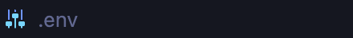
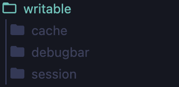
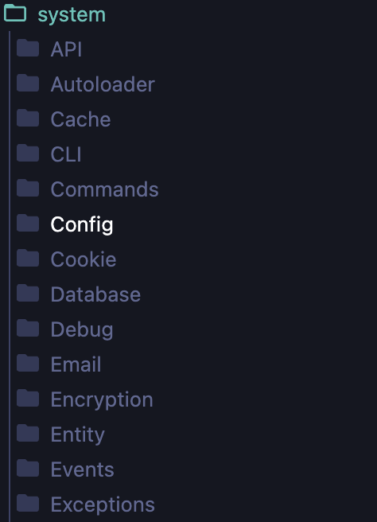
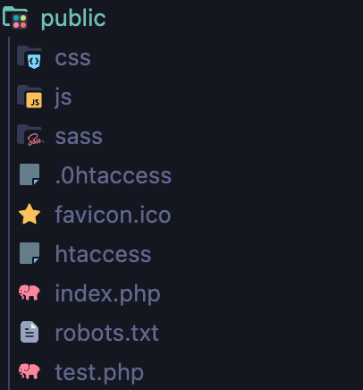
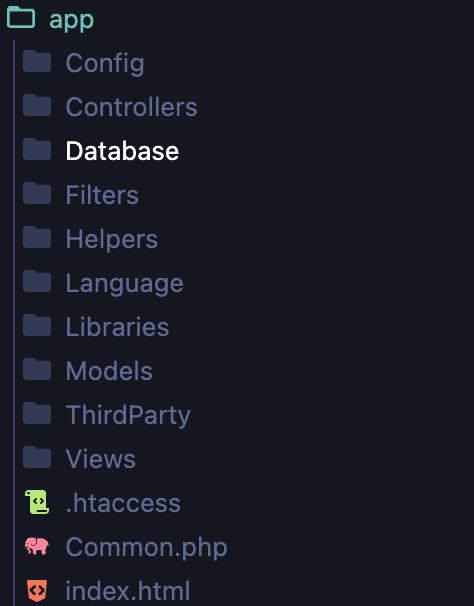
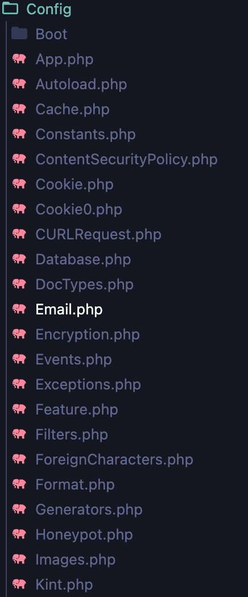
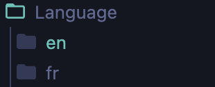
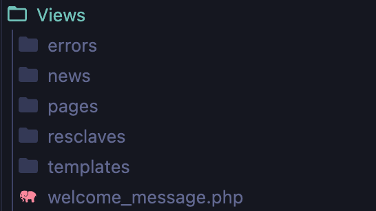

= Documation Technique
:toc: macro
:toc-title: Table des matières
:toclevels: 3

:hide-uri-scheme: 

== Introduction

Cette documentation a pour but de lister le fonctionnement du site web dans le cadre de futurs projets de développement. Vous retrouverez dans cette documentation les fonctionnalités listées et détaillées, ainsi que leur fonctionnement.

toc::[]

== Architecture Code Igniter 4

Code Igniter 4 utilise le modèle MVC (Modèle Vue Contrôleur).

image::images/Archi_racine.png[structure_racine]

Dans le projet, on retrouve 5 parties :

* La première est la configuration du projet Code Igniter avec le fichier .env à modifier pour le fonctionnement de votre site.

* La deuxième est les writables, ils stockent toutes les informations liées à des problèmes.

* Le troisième est le système. Tout le fonctionnement du site est contenu dedans.

* Le quatrième est le dossier public. Dans celui-ci, on peut retrouver les fichiers css, js ou tout autre langage utilisé.

* Le dernier est app, dans celui-ci on retrouve toute l'application, les vues, les contrôleurs et les modèles.

Rentrons dans app pour voir en détail l'application.

Dans app, on retrouve plusieurs dossiers, mais nous allons nous focaliser sur certains dossiers en particulier.

* Le dossier config, où vous pourrez paramétrer l'application et définir les routes de votre projet. L'application utilise énormément les routes. Grâce à elles, on peut se déplacer dans l'application et réaliser des actions.

* Le dossier contrôleur, où on trouve les contrôleurs qui permettent la gestion des vues. Les contrôleurs importent les méthodes qui sont définies dans les modèles.

image::images/Archi_app_2.png[structure_app]

* Le dossier modèle, où il y a tous les modèles de méthodes. On y retrouve des méthodes de requête en base de données ou de récupération de données qui seront appliquées dans les contrôleurs.

image::images/Archi_app_3.png[structure_app]

* Le dossier langage, où on trouve la traduction de tous les champs affichés du site. Actuellement, il y a la version française et anglaise.

* Le dossier views qui stocke toutes les pages du site web, rangées dans des dossiers. Le dossier templates contient les pages pour le footer et la sidebar. Le dossier reclaves, quant à lui, contient toutes les autres pages du site web ainsi que le header.

== Base de données

Maintenant que vous avez vu la structure du projet, passons aux fonctionnalités.

== Accueil

=== Map
L'accueil est la page principale du projet, elle redirige vers la plupart des fonctionnalités du site web.

image::images/accueil.png[accueil]

`Accueil` correspond à la page `accueil.php`.

La carte correspond à :

image::images/accueil_map_code.png[accueil]

Voici le code JavaScript pour ajouter les cartes à la page. Ensuite, on retrouve l'ajout de boutons pour manipuler la map, la légende, et enfin l'ajout de cercles. L'image ne contient que la récupération des maps.

`Accueil.php` ne contient que la carte; la sidebar à droite vient de la page `sidebar.php`.

== Header

image::images/header.png[header]

Le fichier est `header_resc.php`.

image::images/header_code.png[header]

On y retrouve une barre de navigation (`navbar`) avec :

* `Accueil` qui renvoie vers la map en utilisant la route `map`
* La liste des récits avec la route `recit`
* Statistiques avec sa route.

De plus, on y retrouve le code pour définir la langue du site.

image::images/header_code_lang.png[header]

Le script JavaScript est utilisé lorsque le bouton est cliqué, et il va faire une recherche dans le dossier `language`, ici en anglais.

=== Accueil

Quand on clique sur `Accueil` dans le header, voici comment le code va exécuter cette action.

image::images/header_accueil_1.png[lien]

Quand `Accueil` est cliqué, il va chercher la route `map`.

image::images/header_accueil_2.png[route]

La route lui indique qu'il doit exécuter la méthode `index` de la classe `Map` (contrôleur Map).

image::images/header_accueil_3.png[traitement]

Il va importer les méthodes des modèles et les utiliser. Il teste si un des formulaires dans le sidebar est rempli, sinon il va faire l'affichage de base.

image::images/header_accueil_5.png[traitement de base]

Il va exécuter la méthode `getPoints` du modèle `Map`.

image::images/header_accueil_méthode.png[méthode getpoint]

Il va lier la table `tab_recit_v3` et `point` par leur `id_recit` et va retourner toutes les lignes dans `point` qui ont l'attribut `type` égal à `publication`. Les attributs des lignes récupérées par la requête seront égaux à la définition de `allowedFields` au-dessus de la méthode. Si un attribut n'est pas dans `allowedFields`, il ne sera pas récupéré.

image::images/header_accueil_4.png[return]

Puis il va retourner les vues pour les afficher.

=== Liste Récit

Lorsque l'on clique sur `Liste des récits`, 

il va chercher la route `recit`.

image::images/header_recit_1.png[lien]

La route lui indique qu'il doit utiliser la méthode `index` du contrôleur `Recits`.

image::images/header_recit_2.png[route]

La méthode effectue tout d'abord des requêtes pour connaître l'ordre de tri des récits.

image::images/header_recit_3.png[méthode]

Ensuite, elle effectue des requêtes pour rechercher les récits dans `tab_recit_v3`.

image::images/header_recit_5.png[méthode]

image::images/header_recit_4.png[méthode]

Et enfin, elle retourne les vues pour les afficher (`recits.php`).

image::images/header_recit_6.png[liste recit]

Le tableau affiche les récits, avec pour chaque ligne, un lien vers le récit en détail, ainsi que des possibilités de modification et de suppression des récits depuis la liste.

==== Récit

==== Modification Récit

image::images/header_recit_modif_1.png[lien]

Chaque ligne `modifier` a pour lien `modif_recit` suivi des informations sur le récit sélectionné.

image::images/header_recit_modif_2.png[route]

La route appelle la méthode `modif` du contrôleur `Modif`.

image::images/header_recit_modif_3.png[méthode]

La méthode récupère toutes les informations des récits, puis affiche la page de modification du récit avec un formulaire pour chaque champ.

image::images/header_recit_modif_4.png[affichage]

Elle va remplir les champs en parcourant les résultats de la méthode lorsque l'id du récit est égal à l'id du récit venant de l'URL.

Une fois cela fait, dès que l'on valide le formulaire, celui-ci utilise la route `Modif/ModifPoly_Recit`.

image::images/header_recit_modif_5.png[route]

La route renvoie vers la méthode `ModifPoly_Recit` du contrôleur `Modif`.

image::images/header_recit_modif_6.png[méthode]

La méthode va récupérer tous les champs du formulaire.

image::images/header_recit_modif_7.png[méthode]

Puis effectuer les traitements dans la base de données. Elle va modifier le récit avec les informations, supprimer les lignes dans `recit_poly` qui sont égales à l'id du récit, puis réinsérer dans la base de données les liaisons entre les polygones et les récits. Elle affichera ensuite la liste des récits.

==== Suppression Récit

image::images/header_recit_suppr_1.png[code]

Lors du clic sur le lien, il va chercher la route `Suppr/SupprRecit` et demander, via une pop-up, une confirmation de la volonté de supprimer le récit.

image::images/header_recit_suppr_2.png[route]

La route va appeler la méthode `SupprRecit` du contrôleur `Suppr`.

image::images/header_recit_suppr_3.png[méthode]

La méthode va supprimer tous les points liés au récit ainsi que le récit lui-même et les liaisons entre les récits et les polygones. Elle affichera ensuite la liste des récits.

=== Statistiques

Lorsque l'on clique sur `Statistiques`, on utilise la route.

image::images/header_stat_1.png[lien]

Cette route nous renvoie sur la méthode `statistiques` du contrôleur `Admin`.

image::images/header_stat_2.png[route]

Le contrôleur va retourner les vues dans `resclaves`, `statistique.php` ainsi que le header.

image::images/header_stat_3.png[méthode]

=== Langue

En haut à droite du site web, il est possible de changer la langue du site. Quand on choisit une langue, le code fait des requêtes pour remplacer tous les champs où l'on retrouve `lang()`.

image::images/header_lang_1.png[code_trad]

Pour cela, il va chercher dans le fichier `headergeo.php` et il va chercher la ligne `nav_bar.home` ou `nav_bar.list_narrative`.

image::images/header_lang_2.png[trad]

Il existe la même chose pour le français. Cela permet d'avoir une traduction rapide et précise.

== Sidebar

image::images/sidebar.png[sidebar]

Dans le sidebar, on peut trouver plusieurs fonctionnalités :

=== Sélectionner un Type de Lieu

Le premier menu déroulant où l'on peut rechercher par type de lieu permet d'afficher tous les points du type demandé.

image::images/sidebar_formpoint_1.png[form]

On peut voir le formulaire avec plein de `if`. Cela permet de définir le type de point recherché. Puis la route est définie dans l'action du formulaire et non dans le bouton `submit`, mais le principe reste le même.

image::images/sidebar_formpoint_2.png[route]

La route nous indique que l'on va utiliser la méthode `index` de la classe `Map`, comme si l'on voulait revenir à la carte.

image::images/sidebar_formpoint_3.png[méthode]

Sauf que cette fois-ci, on ne va pas utiliser la dernière clause du `if` mais la clause où `select_place` est défini. Notre formulaire va définir `select_place` avec une valeur, ce qui voudra dire que l'on a utilisé le formulaire. Suite à cela, le code va retourner les vues définies avec comme information dans `data`, les points qui sont du type choisi ainsi que les territoires à afficher sur la carte.

=== Sélectionner un Récit

Le deuxième menu déroulant est un menu où l'on peut choisir quel récit on veut afficher sur la carte.

image::images/sidebar_formrecit_1.png[form]

La route nous renvoie sur la méthode `index` du contrôleur `Map`.

image::images/sidebar_formrecit_2.png[route]

Et cette fois-ci, on va utiliser le premier `if` de la méthode car le formulaire a défini `select_recit`.

image::images/sidebar_formrecit_3.png[méthode]

La méthode va retourner les vues demandées avec toutes les informations liées à un récit.

=== Menu de Gestion

Dans le menu de gestion, il y a deux groupes de liens :

image::images/sidebar_gestionmenu.png[code]

Le premier groupe qui s'affiche seulement si l'utilisateur est connecté et un deuxième où il affiche soit `déconnexion` quand on est connecté ou `connexion` quand on ne l'est pas.

=== Déconnecté

Commençons par le début, et donc quand on arrive sur le site web, l'utilisateur est déconnecté.

==== Connexion

Pour se connecter, il faut cliquer sur le bouton suivant :

image::images/sidebar_gestionmenu_con_1.png[code]

Comme l'utilisateur n'est pas connecté, il utilisera la route `/connexion` :

image::images/sidebar_gestionmenu_con_2.png[code]

Cette route renvoie vers la méthode `showconnexion` du contrôleur `Admin` :

image::images/sidebar_gestionmenu_con_3.png[code]

La méthode renvoie la vue de connexion (`connexion.php`).

Sur la page de connexion, on peut remplir deux champs du formulaire (`username`, `password`) :

image::images/sidebar_gestionmenu_con_4.png[connexion]

Le formulaire enverra les données en utilisant sa route `/Admin/login` :

image::images/sidebar_gestionmenu_con_5.png[route]

Cette route mènera à la méthode `login` du contrôleur `Admin` :

image::images/sidebar_gestionmenu_con_6.png[connexion]

La méthode récupérera les champs du formulaire, hashera le mot de passe, et le comparera au mot de passe reçu dans la requête en utilisant

==== Ajout Point 

==== Ajout Récit

==== Ajout Polygone

==== Ajout Esclave/Auteur 

==== Modification d'un Esclave/auteur

==== Suppression d'un Esclave/auteur

== Footer

image::images/footer_1.png[footer]

Dans le footer, on retrouve deux fonctionnalités : le contact avec la possibilité d'envoyer un mail à l'adresse mail du site et une page avec des informations et remerciements.

image::images/footer_code_1.png[code]

=== Contacts

Dans la route, on appelle la méthode `contact` du contrôleur `Map`.

image::images/footer_contact_2.png[route]

Cette méthode retourne la page `contact`.

image::images/footer_contact_3.png[méthode]

Dans cette page, on retrouve un formulaire où l'on peut remplir les informations à transmettre dans le mail.

image::images/footer_contact_4.png[formulaire]

Mais on trouve aussi du JavaScript pour faire l'envoi du mail.

image::images/footer_contact_5.png[service_id]

Le premier bloc définit le service à utiliser par son identifiant.

image::images/footer_contact_8.png[service]

Et le deuxième bloc contient l'envoi du mail avec le template à utiliser. Le template permet de pré-structurer le mail avec les informations fournies dans le mail.

image::images/footer_contact_6.png[envoi]

image::images/footer_contact_7.png[template]

=== Information

Pour les informations du site web :

image::images/footer_about_2.png[route]

Le lien renvoie vers la méthode `about` du contrôleur `Map`.

image::images/footer_about_3.png[méthode]

La page contient juste des informations et des remerciements.
