= Documation Technique :

:toc: macro
:toc-title: Table des matières

:hide-uri-scheme: 

== Introduction

Cette documentation a pour de lister le fonctionnement du site web dans le cadre de futur projet de développement sur celui-ci.Vous retrouverez dans la doc les fonctionnalitées listé et détaillé ainsi que leur fonctionnement.

toc::[]

== Architecture Code Igniter 4

Code Igniter 4 utilise le model MVC (Model Vue Controlleur).

image::images/Archi_racine.png[structure_racine]

Dans le projet on retrouve 5 parties :
----

* La première est la configuration du projet code igniter avec le fichier .env a modifier pour le fonctionnement de votre site.

image::images/Archi_racine_1[structure_racine]

* La deuxième est les writables, ils stocke tout les informations du a des problèmes.

image::images/Archi_racine_2[structure_racine]

* Le troixième est système. Tout le fonctionnement du site est dedans.

image::images/Archi_racine_3[structure_racine]

* le quatrième est public dasn celui ci on peut retrouvé les fichier css,js ou tout autre language utilisé.

image::images/Archi_racine_4[structure_racine]

* lle dernier est app, dans celui-ci on retrouve toute l'application, les vues ,les controlleur et les models.

image::images/Archi_racine_5[structure_racine]
----

Rentront dans app pour voir en detail l'application.

----

image::images/Archi_app[structure_app]

Dans app on retrouve plusieur dossier, mais on va ce focaliser sur quelque dossier.

* le dossier config ou vous pourrez paramètrer l'application et definir les routes de votre projet.L'application utilise énormément les routes. Grace a elle on peut ce déplacer dasn l'aplication et faire des actions.
* le dossier controlleur ou on trouve les controlleur permettent la gestion des vues, les controlleurs imports les méthodes qui sont définis dans les models.
* le dossier model ou il y a tout les models de méthodes.On y retrouve des méthodes de requète en base de données ou des récupèration de données qui seront appliqués dans les controlleurs.
* le dossier language ou on trouve la traduction de tout les champs affichers du site.Actuellement il y a la version française et anglaise.
* le dossier views qui stocke toute les pages du site web rangé des dans dossier. Templates contient les pages pour le footer et la sidebar. le dossier reclaves contient lui toute les autres pages du site web ainsi que le header.

----

Passont a la base de données liée au projet

== Base de données

----

----

Maintenant que vous avez vue la structure du projet et la base de données, passontaux fonctionnalitées.

== Accueil

=== map
Accueil est la page principale du projet, elle redirige vers la pluspard des fonctionnalitées du site web.

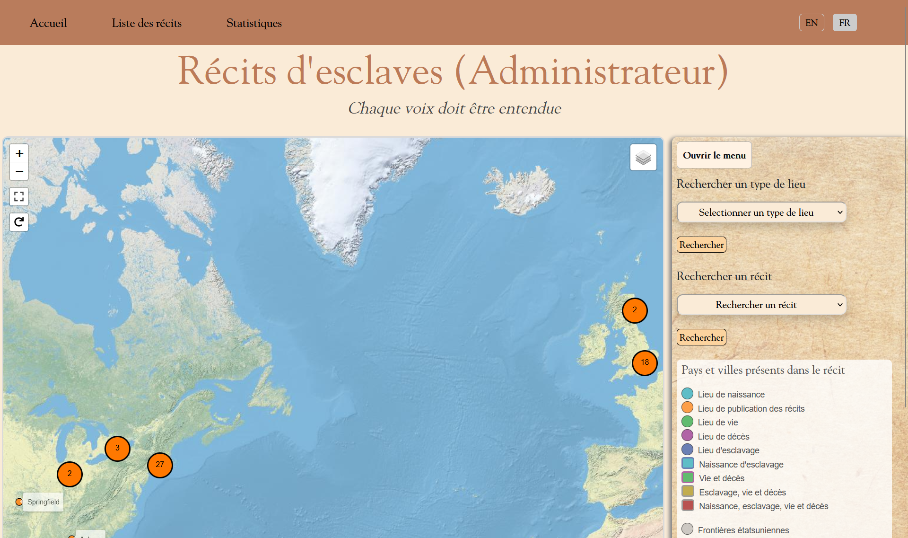

Accueil correspond a la page accueil.php

la carte correspond a :

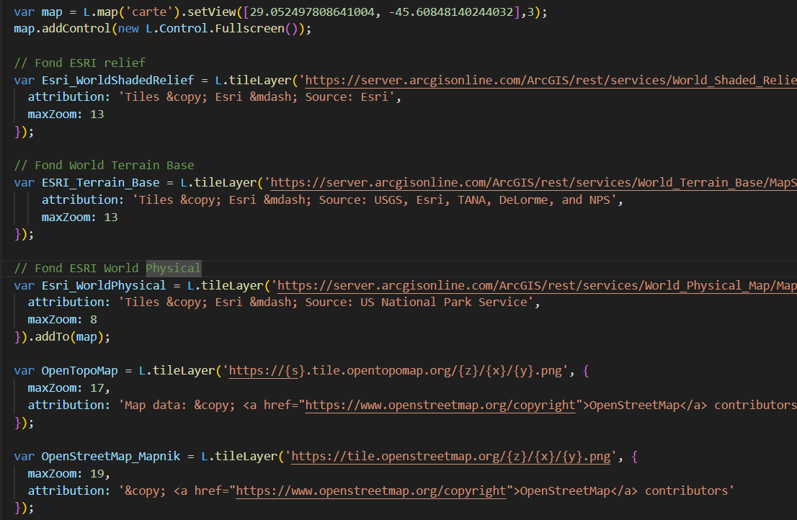

Voici le code javascript pour ajouté les cartes a la page, puis on retrouve l'ajout de bouton pour manipulé la map ,la légende et enfin l'ajout de cercle.L'image ne contient que la récupération des map.

Accueil.php ne contient que la carte la sidebar a droite vien de la page sidebar.php

== Header

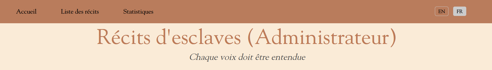

Le fichier est header_resc.php

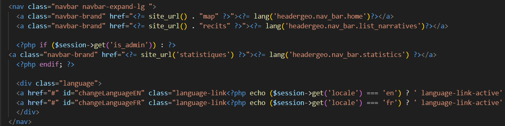

On y retrouve une navbar avec accueil qui renvoie vers la map en utilisant la route map masi aussi la liste des récits avec la route recit et enfin statistique avec ca route.Mais on retrouve aussi le code pour definir la langue du site.

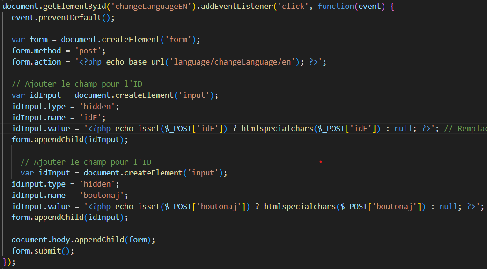

Le script js est utilisé quand le bouton est cliqué est il vas faire une recherche dans le dossier language , ici en anglais.

=== Accueil

Quand on clique sur accueil dans le header voici comme le code va exécuté cette action.

image::images/header_accueil_1.png[lien]

Quand accueil est cliqué il va cherché la route map.

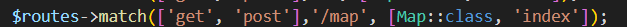

la route lui indique qu'il doit exécuté la méthode index de la class Map (controlleur Map).

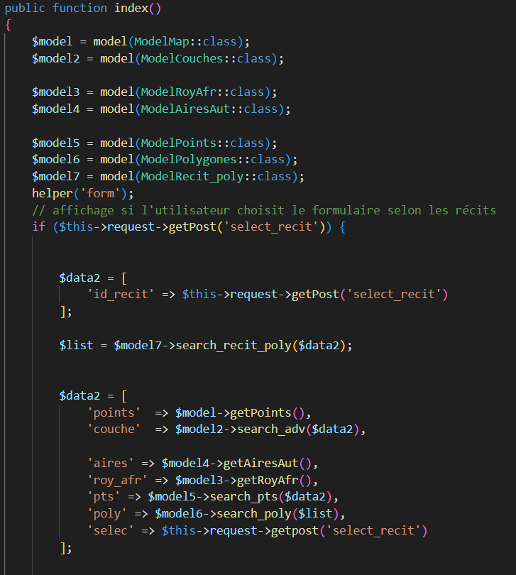

Il va import les méthodes des models et les utiliser. Il teste si un des formulaires dans le sidebar est remplie sinon il va faire l'affichage de base.

image::images/header_accueil_5.png[traitment de base]

il va éxécuté la méthode getPoints du modelMap.

image::images/header_accueil_méthode.png[methode getpoint]

Il va liée la table tab_recit_v3 et point par leur id_recit et vas retourné toute les lignes dans point qui on l'attribue type égale a publication.Les attribues des lignes récupérer par la requète seront égale a la définition de allowedFields au dessus de la méthode.SI un attribue n'est pas dans allowedFields il ne sera pas récupérer.

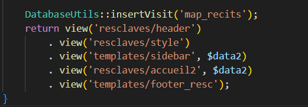

puis il va retourné les vues pour les afficher.

== Liste Recit

Quand on clique sur liste des récits

il va chercher la route "recit".

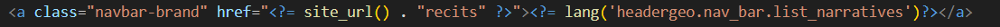

la route lui indique qu'il doit utilisé la méthode index du controlleur Recits

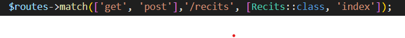

La méthode fais tout d'abord des requete pour connaitre l'odre de tri des récits

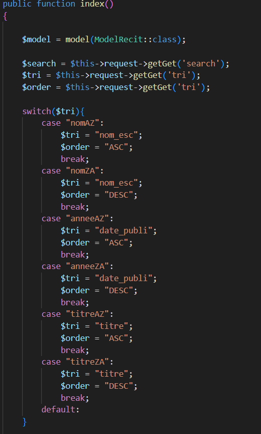

puis va faire des requètes pour recherche les récits dans tab_recit_v3.

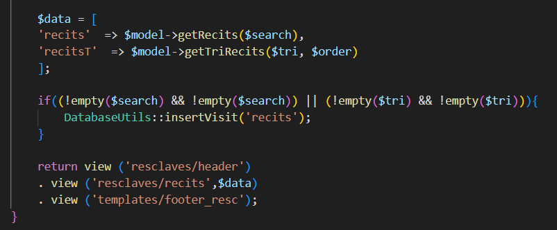

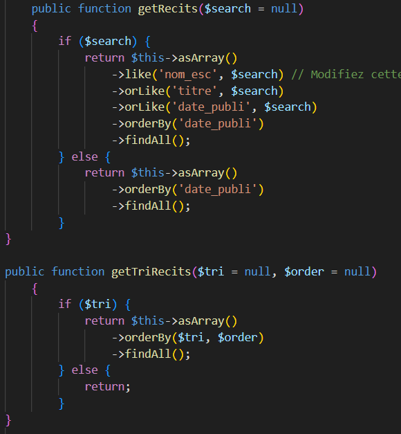

et enfin il va retourné les vues pour les afficher (recits.php)

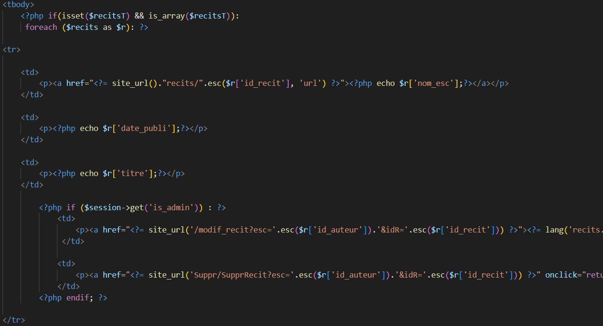

le tableau affiche les récits avec pour chaque ligne un lien vers le récit en détail. ainsi que des possibilitées de modifier et supprimer les récits depuis la liste.

=== Recit

==== Modification Récit

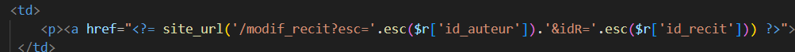

Chaque ligne modifier a pour lien modif_recit plus des informations sur le récit sélectionné. 

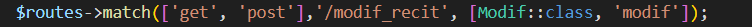

La route appel la méthode modif du controlleur Modif

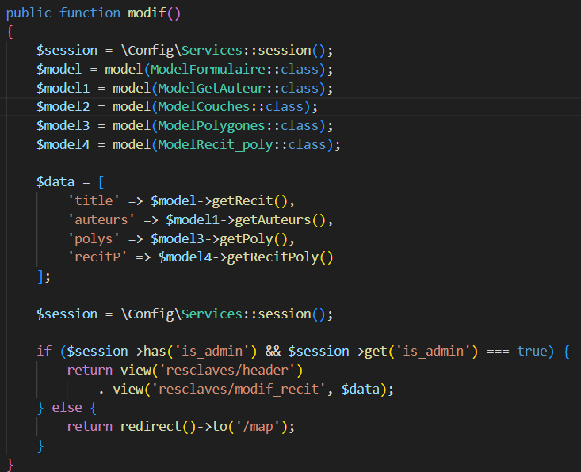

La méthode récupère toute les information des récit par récit puis affiche la page de modification du récit avec un formulaire pour chaque champ.

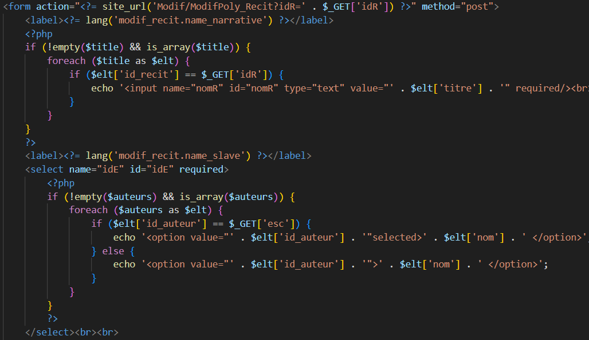

Il vas remplir les champs en parcourant les résultats de la méthode quand l'id du recit est égale a l'id du récit venant de l'url.

Un fois cela,des que l'on valide le formulaire.Le formulaire utilise la route "Modif/ModifPoly_Recit"

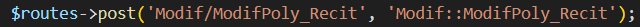

La route renvoie vers la méthode ModifPoly_Recit du controlleur Modif

image::images/header_recit_modif_6.png[méthode]

La méthode va récupérer tout les champs du formulaire 

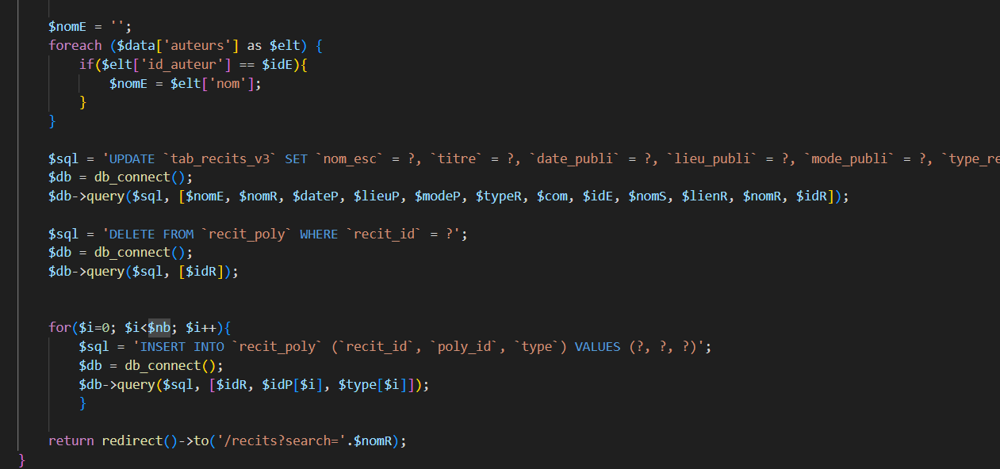

Puis va faire les traitement dans la base de données.Il va modifier le récit avec les informationset supprimer les lignes dasn recit_poly qui sont égale a l'id du récit puis va re-insérer dans la base de donnée les liaison être les polygones et les récits.Puis va afficher la liste des récits.

==== Suppression Récit

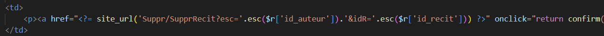

Lors du clic sur le lien il va cherché la route "Suppr/SupprRecit" et demandé  avec une pop up une confirmation de la volonter de supprimer le récit.

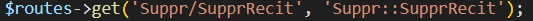

la route va appeller la méthode SupprRecit du controlleur Suppr(Suppr.php)

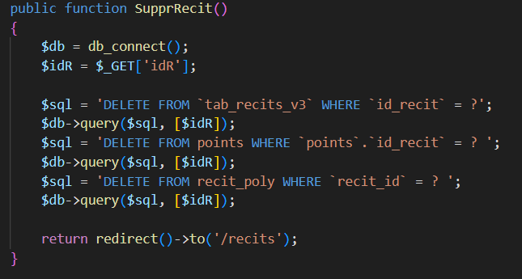

La méthode va supprimer tout les points liées au récit ainsi que le récit et les liaisons être les récits et les polygones. Puis va afficher la liste des récits.

==== Récit en Détail

image::images/header_recit_recit_1.png[listeRecit]

Lors que l'on clique sur un récit dans la liste, le formulaire appel la route recits/ + l'id du récit

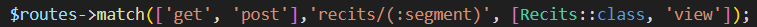

La route appel la méthode view  du Controlleur Recits

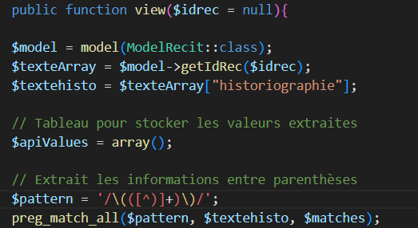

La méthode récupère les infomations du récit sélectionnée dans les paramètre puis fait une recherche de toute les informations liée au récit en paramètre.Puis le champ "historiographie" est récupérer a pars pour être modifier.

Et enfin, on définis un pattern () et on recupère tout les occurences au lieu y a des paranthèses.

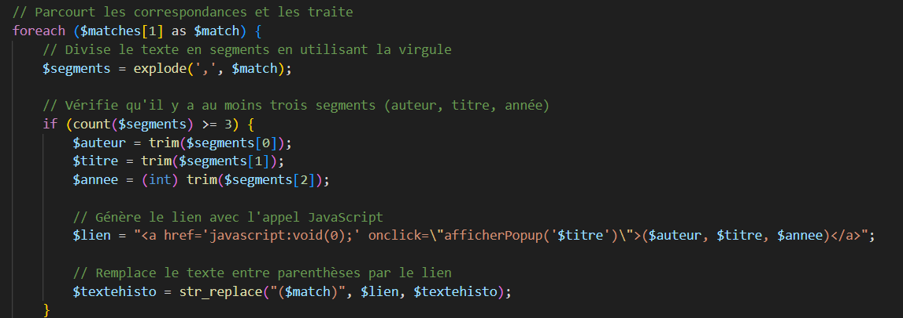

Pour chaque occurence des paranthèse on va diviser le texte avec comme séparateur la virgule. est l'affecté a $segments.

Si le segments a trois éléments, cela veux dire que dans la paranthèse on retrouve (Auteur,Titre raccourci, page). Puis on veut récupérer chaque élément et on vas générer un string qui appel la fonction javascript permétant de écupérer les infos de Zotero.

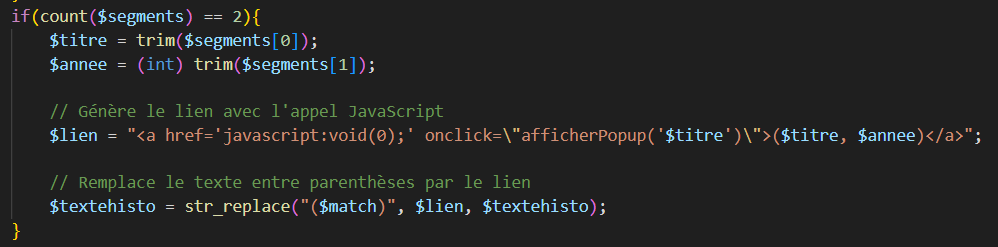

Si le nombre d'éléments est égale a 2, cela veux dire que il y a le (Titre,page).Mais le principe reste le même.

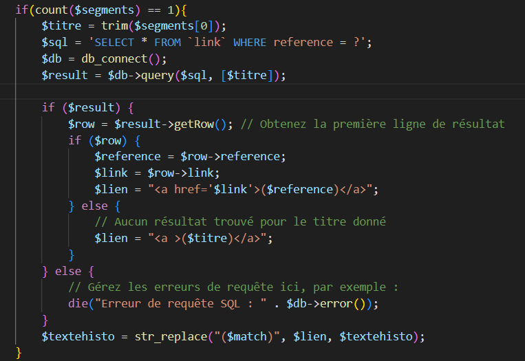

Si le nobre d'élement dans la paranthèse est égale a 1,cela ve dire que c'est un lien est donc on va récupérer les liens stocker dans la table Link. Si le lien existe il vas modifier les pour mettre le lien.Sinon il ne change rien.

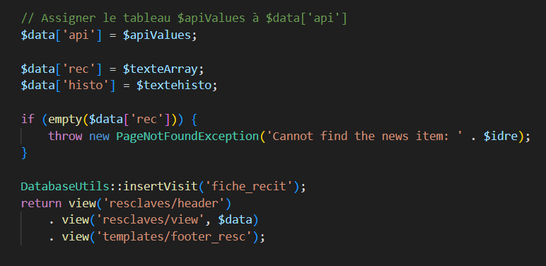

Puis il affiche la page view avec les informations du récit.

=== Affichage d'un récit

Dans la page on retrouve toute les informations liée au récit sélectionnée.

==== Ajout d'un lien

Mais on trouve aussi la possibilité de modifier et supprimer le récit depusi cette page.Mais le principale est une possiblité d'ajouté des liens dans la bd.

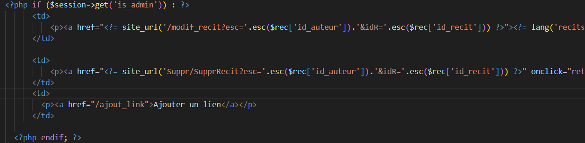

Lors du clique sur le lien, la route appel "/ajout link"

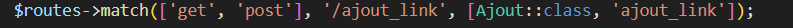

La route appel la méthode ajout_link du controlleur Ajout.

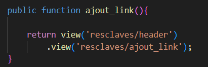

La méthode s'occupe juste de d'afficher la page d'ajout.

image::images/header_recit_view_4.png[page]

Sur cette page on retrouve deux formualires.Le premier est juste un formulaire avec 2 champs, un pour le nom du lien et un autre pour le lien.

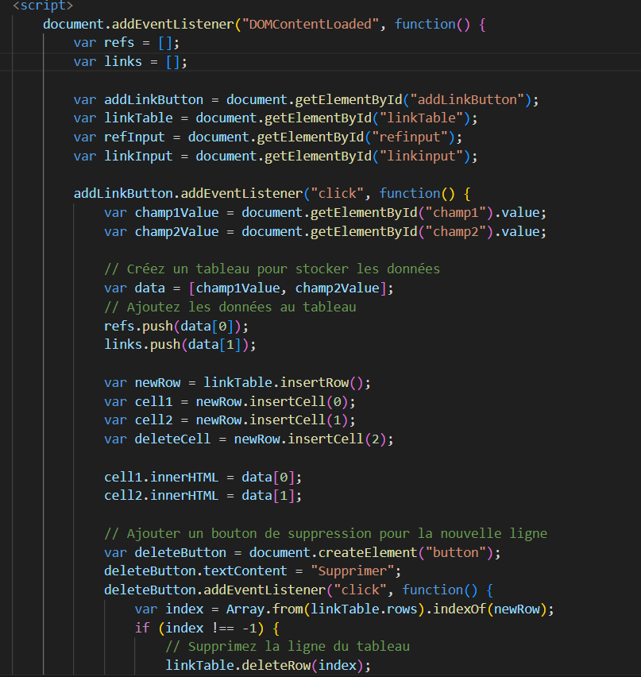

Quand on clique sur ajouter, le script java script s'occupe d'ajouté les information du 1er formulaire dans le tableau du deuxième.Cela permet d'ajouter plusieurs lie nen même temps.

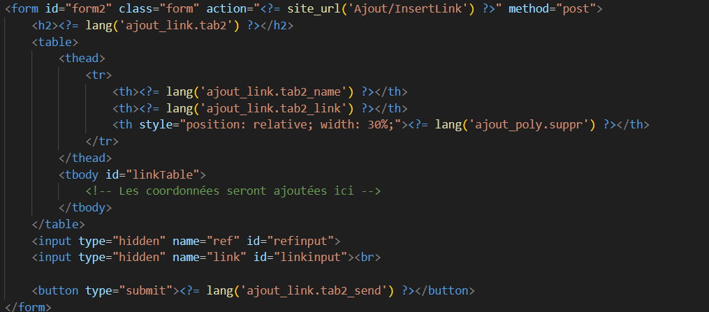

LE 2ème formulaire sert a stocker et afficher les liens à ajouter.Quand on clique sur validé du formualaire, il appel la route "Ajout/InsertLink"

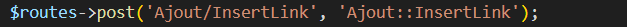

La route renvoie vers la méthode InsertLink du controlleur Ajout

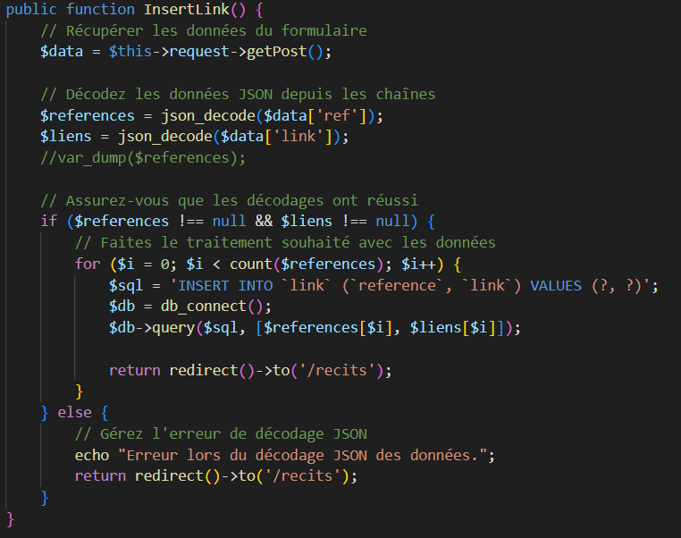

La méthode vas inséret dans la table link les liens créé.

==== Api Zotero

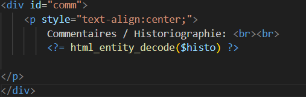

L'api Zotero sera utilisé que dans la partie commentaire.

image::images/header_recit_api_2.png[js1]

Quand on clique sur un lien dasn cette partie il appel la méthode afficherPopup dans le but d'afficher des information détailler de la source.

Pour cela on trouve l'api avec la clé est l'userid mais aussi un notification en haut a droite de l'écrans pour informer l'utilisateur que la recherche est en cour.

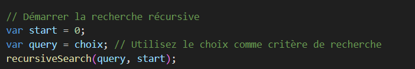

La fonction démare avec start et query a 0 et appel la méthode recursivesearch avec ces paramètres.

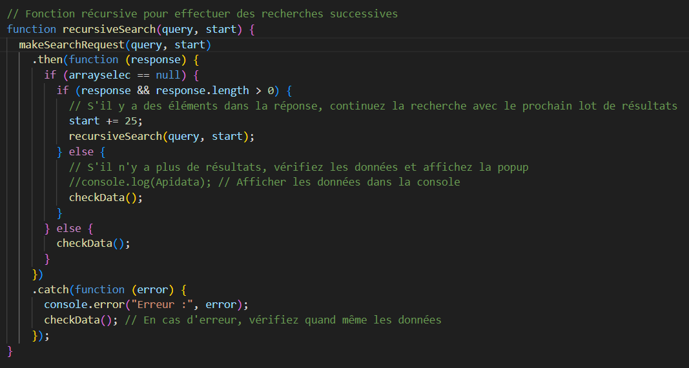

la fonction quand a elle va appeller la fonction makesearchRequest aevc les paramètre quel a reçu. Puis a chaque résultat de cette fonction, elel va testé si la demande a était trouvé ou si il reste des éléments a recherché dasn l'api.Si il en reste, elle se rapelle avec les début de la recherche +25 éléments.Dans le cas ou il n'y a plus d'élément ou il a était trouvé elle appel la fonction checkdata.

image::images/header_recit_api_5.png[js4]

Cette fonction fait une requete de 25 éléments définis par la limit dans url de l'api et comment au x ème élments définis par le start reçu.Si il trouve l'élément il va modifier la variable found a true ce qui va stopper les requetes et faire l'affichage.

image::images/header_recit_api_6.png[js5]

Quand checkData est appellé il remplis les champs par le résultat récupérer.

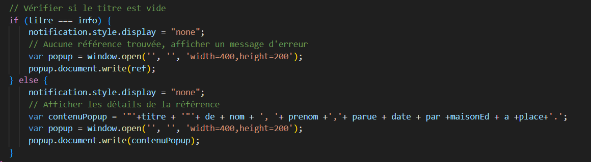

Puis si le titre est définis il affiche un popup avec les informations de la sources et retire la notification de recherche.Mais si le titr en'ets pas définis il fait une popup avec information non trouvé.

=== Statistique

Quand on clique sur statistique, on utilise la route.

image::images/header_stat_1.png[lien]

Cette route nous renvoie sur la méthode statistiques du controlleur Admin.

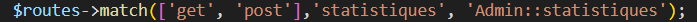

Le controlleur va retourner les vues dans resclaves, statistique.php ainsi que le header.

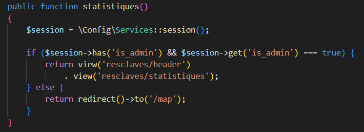

=== Language

en haut a droite du site web, il est possible de changé la langue du site.Quand on choisit un langue le code fait des requêtes pour remplacé tout les champ ou un retrouve "lang()".

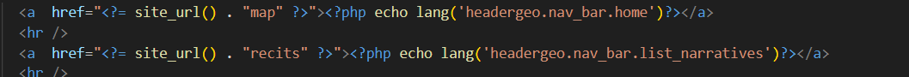

Pour cela il va cherché dans le fichier headergeo.php et il va chercher la ligne nav_bar.home ou nav_bar.list_narrative

image::images/header_lang_2.png[trad]

Il existe la meme chose pour le français.Cela permet d'avoir une traduction rapide et précise.

== sidebar

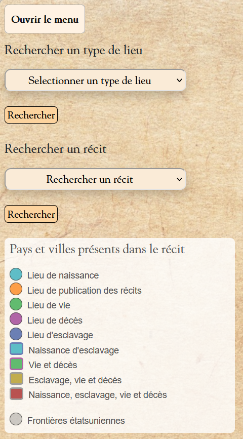

Dans le sidebar on peut trouver plusieur fonctionnalités:

=== Sélectionner un type de lieu

le premier menu déroulant ou on peut rechercher par type de lieu permet d'afficher tout les points du type demandé.

image::images/sidebar_formpoint_1.png[form]

On peut voir le formulaire avec plein de if.Cela permet de definir le type de point recherché.Puis la route et définie dans le action du formulaire est non dans le bouton submit mais le principe reste le même.

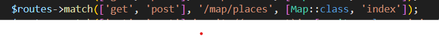

la route nous indique que l'on va utilisé la méthode index de la class Map comme quand si on voulais revenir a la carte.

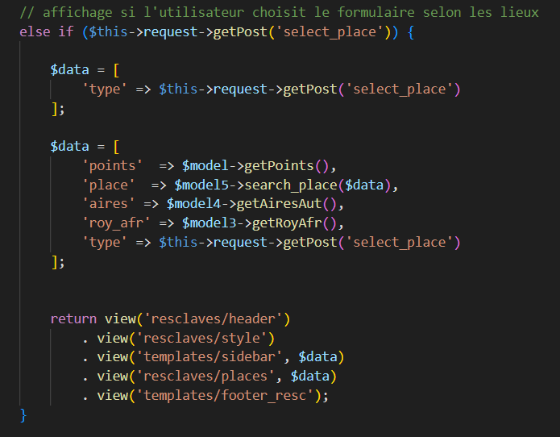

Sauf que cette fois ci on pas aps utilisé la dernière clause du if mais la clause ou select_place  est définis.notre formulaire va définir select_place avec un valeur ce qui voudras dire que on aa utilisé le formulaire.Suite a cela le code pas retourné les vues définis aevc comme information dans data. Les points qui sont du type choisie ainsi que les territoires a affiché sur la carte.

=== Sélectionner un récit

Le deuxième menu déroulant est un menu ou on peut choisir quel récit on veux afficher sur la carte.

image::images/sidebar_formrecit_1.png[form]

La route nous renvoie sur la méthode index du controlleur Map

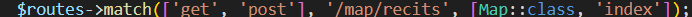

Et cette fois ci, on vas utiliser le premier if de la méthode car le formulaire a définis select_recit.

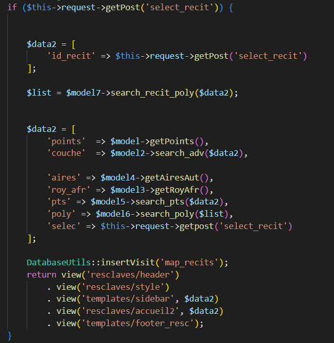

La méthode vas retourner les vues demandé avec toute les informations liée a un récit.

=== Menu de gestion

Dans le menu de gestion il y a deux groupe de lien :

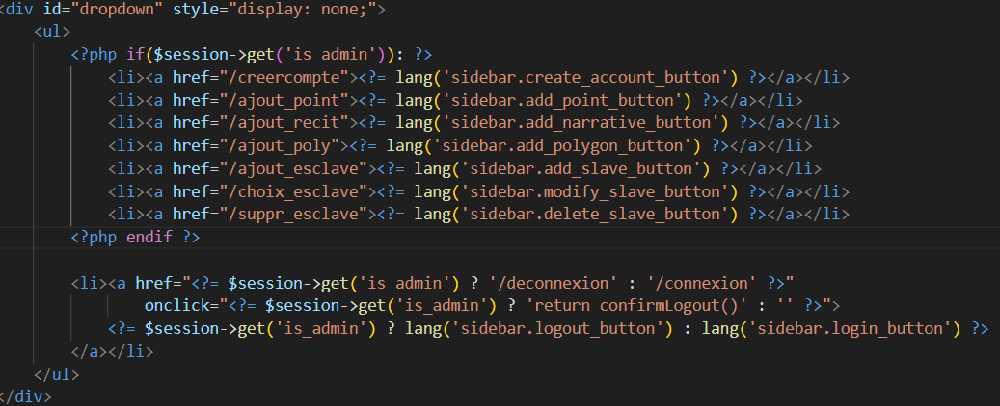

Le premier groupe qui s'affiche que s'y l'utilisateur est connecté et une deuxième ou il affiche soit deconnection quand on est connecté ou connxion quand t'on ne les pas.

=== Déconnecté
Commençons par le début et donc quand on arrive sur le site web,l'utilisateur est déconnecté.

==== Connection

Pour se connecter, il faut cliquer sur le bouton suivant :

image::images/sidebar_gestionmenu_con_1.png[code]

Comme l'utilisateur n'est pas connecté, il utilisera la route /connexion :

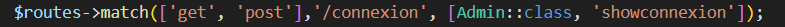

Cette route renvoie vers la méthode `showconnexion` du contrôleur admin :

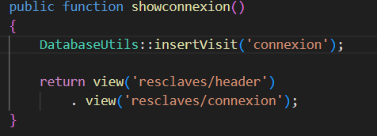

La méthode renvoie la vue de connexion (connexion.php).

Sur la page de connexion, on peut remplir deux champs du formulaire (username, password) :

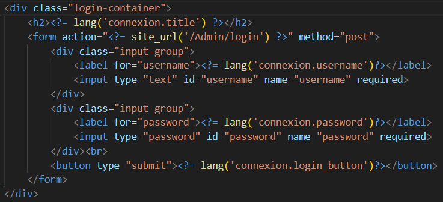

Le formulaire enverra les données en utilisant sa route "/Admin/login" :

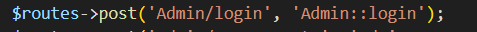

Cette route mènera à la méthode `login` du contrôleur admin :

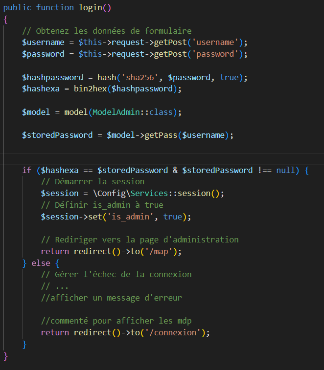

La méthode récupérera les champs du formulaire, hashera le mot de passe et le comparera au mot de passe reçu dans la requête en utilisant le nom d'utilisateur fourni dans le formulaire. Si les informations sont correctes, elle créera une session "is_admin" qui permettra d'accéder à des actions limitées aux administrateurs, puis redirigera vers la carte en utilisant la route /map. Si le mot de passe est incorrect, l'utilisateur sera redirigé vers la page de connexion.

=== Connecté

==== Déconnection

Maintenant que l'on est connecter, le menu a changé de nouveau bouton sont apparue est parmis ceux ci déconnexion

image::images/sidebar_gestionmenu_con_1.png[code]

quand on clique sur le bouton déconnexion.

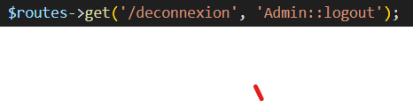

la route nous renvoie vers la méthode logout du controlleur admin.

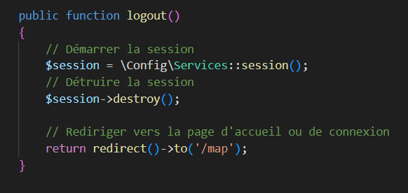

La méthode quand à elle détruit la session "is_admin" est retourne la vers la route /map.

==== Création de compte

Pour créer un nouveau compte de connexion il faut déjà être connecté.

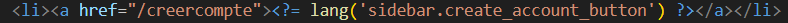

Quand on clique sur le bouton il applique la route définie (/creercompte).

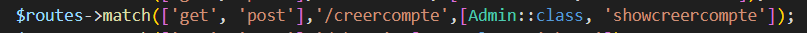

La route  renvoie vers la méthode showcreercompte du  controlleur Admin.

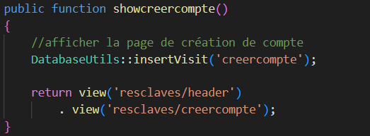

Cette méthode ce charge d'afficher la page créer compte.

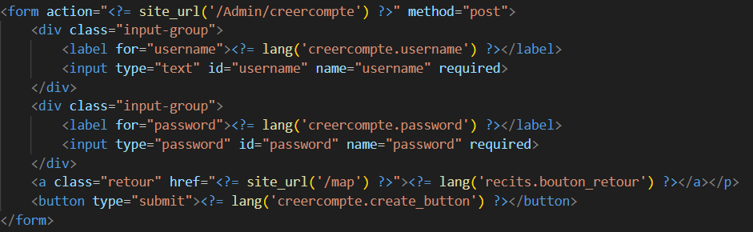

Sur cette page on retrouve un formulaire qui quand il est validé utilise la route (/Admin/creercompte)

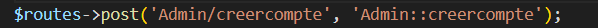

La route renvoie vers la méthode creercompte du controlleur admin

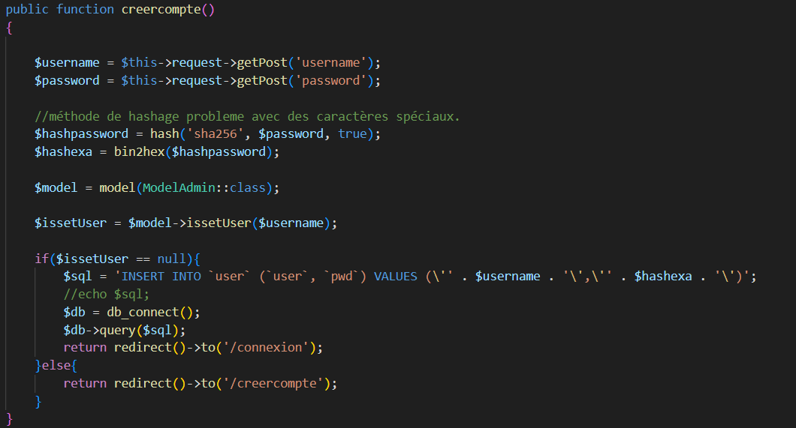

La méthode quand a elle vas préparer la requete d'insertion dans la bd est vérifier si il exite déjà pas une personne avec cette identifiant.Si cela est bon, il va insérer dans la base de données le compte.

==== Ajout Point 

==== Ajout Récit

==== Ajout Polygone

==== Ajout Esclave/Auteur 

==== Modification d'un Esclave/auteur

==== Suppression d'un Esclave/auteur

== Footer

Dans le footer on retrouve deux fonctionnalitées. Le contact avec la possibilité d'envoyé un mail sur l'adresse mail du site  et un page avec des informations et remerciment.

image::images/footer_code_1.png[code]

=== Contact

Dans route appelle la méthode contact du controlleur Map.

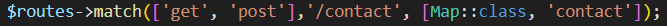

Cette méthode retourne la page contact.

image::images/footer_contact_3.png[méthode]

Dans cette page on retrouve un formulaire on remplir les informations a transmettre dans le mail.

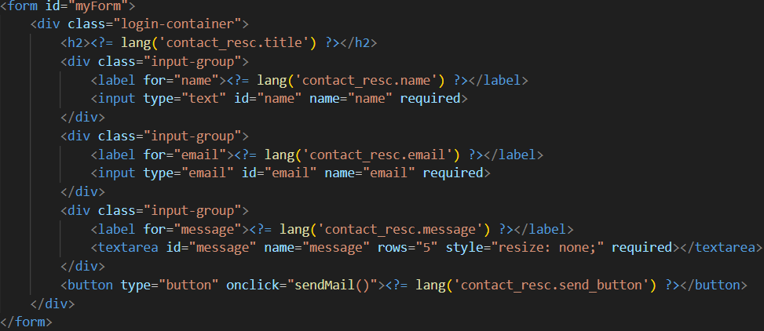

Mais on trouve aussi du java script pour faire l'envoie du mail.

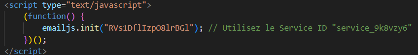

Le premier block définis le service a utilisé par son identifiant.

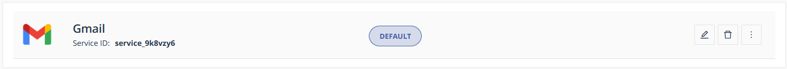

Et le deuxième block contient l'envoie du mail avec le template a utilisé. Le template permet de pré-structurer le mail avec les informations fournie des le mail.

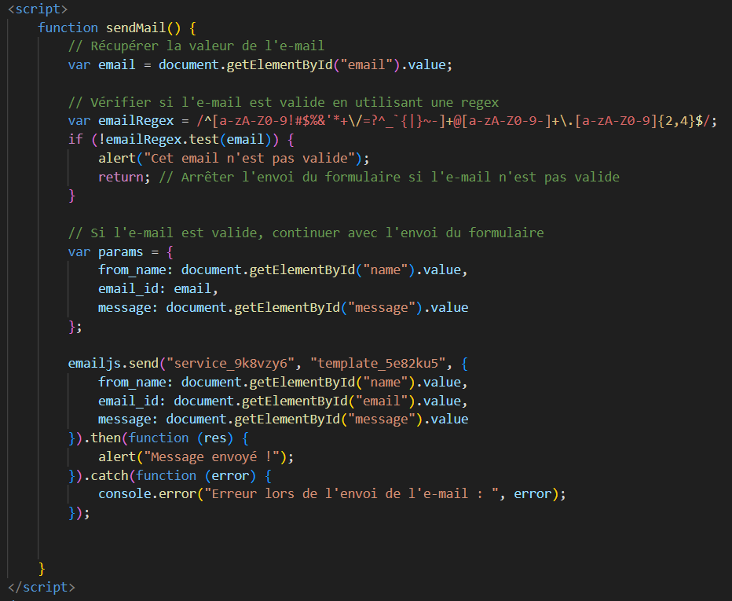

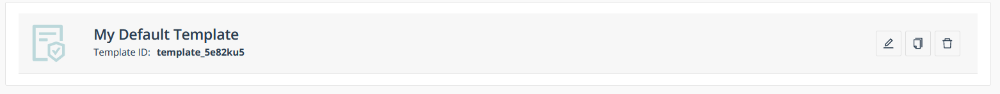

=== Information

Pour les informations du site web.

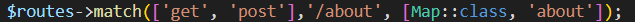

Le lien renvoie vers vers la méthode about du controlleur Map.

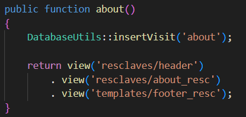

La page contient juste des informations et des remerciments.
