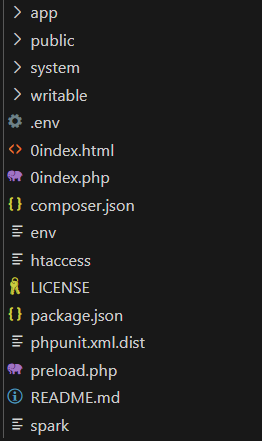
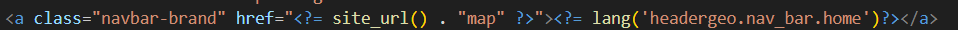
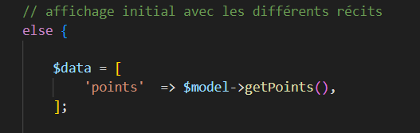
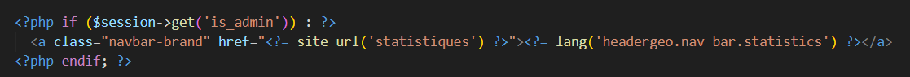
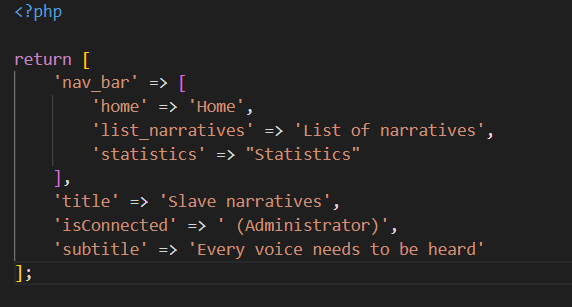
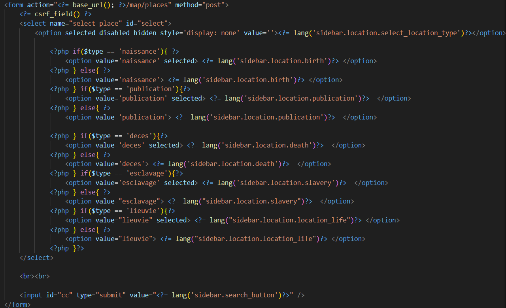
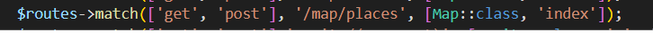
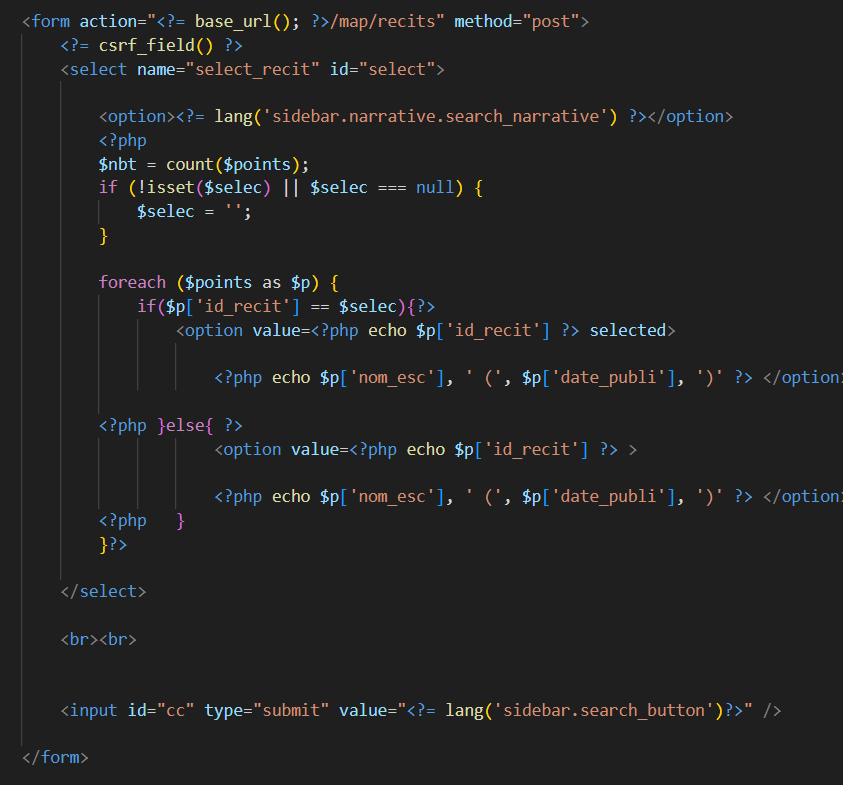
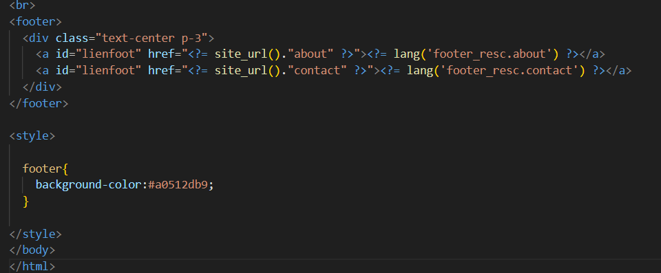

= Documation Technique
:toc: macro
:toc-title: Table des matières
:toclevels: 3

:hide-uri-scheme: 

== Introduction

Cette documentation a pour but de lister le fonctionnement du site web dans le cadre de futurs projets de développement. Vous retrouverez dans cette documentation les fonctionnalités listées et détaillées, ainsi que leur fonctionnement.

toc::[]

== Architecture Code Igniter 4

Code Igniter 4 utilise le modèle MVC (Modèle Vue Contrôleur).

Dans le projet, on retrouve 5 parties :

* La première est la configuration du projet Code Igniter avec le fichier .env à modifier pour le fonctionnement de votre site.

image::images/ArchiRacine1.png[structure_racine]

* La deuxième est les writables, ils stockent toutes les informations liées à des problèmes.

image::images/Archi_racine_2.png[structure_racine]

* Le troisième est le système. Tout le fonctionnement du site est contenu dedans.

image::images/Archi_racine_3.png[structure_racine]

* Le quatrième est le dossier public. Dans celui-ci, on peut retrouver les fichiers css, js ou tout autre langage utilisé.

image::images/Archi_racine_4.png[structure_racine]

* Le dernier est app, dans celui-ci on retrouve toute l'application, les vues, les contrôleurs et les modèles.

Rentrons dans app pour voir en détail l'application.

Dans app, on retrouve plusieurs dossiers, mais nous allons nous focaliser sur certains dossiers en particulier.

* Le dossier config, où vous pourrez paramétrer l'application et définir les routes de votre projet. L'application utilise énormément les routes. Grâce à elles, on peut se déplacer dans l'application et réaliser des actions.

image::images/Archi_app_1.png[structure_app]

* Le dossier contrôleur, où on trouve les contrôleurs qui permettent la gestion des vues. Les contrôleurs importent les méthodes qui sont définies dans les modèles.

image::images/Archi_app_2.png[structure_app]

* Le dossier modèle, où il y a tous les modèles de méthodes. On y retrouve des méthodes de requête en base de données ou de récupération de données qui seront appliquées dans les contrôleurs.

image::images/Archi_app_3.png[structure_app]

* Le dossier langage, où on trouve la traduction de tous les champs affichés du site. Actuellement, il y a la version française et anglaise.

* Le dossier views qui stocke toutes les pages du site web, rangées dans des dossiers. Le dossier templates contient les pages pour le footer et la sidebar. Le dossier reclaves, quant à lui, contient toutes les autres pages du site web ainsi que le header.

image::images/Archi_app_5.png[structure_app]

== Base de données

Maintenant que vous avez vu la structure du projet, passons aux fonctionnalités.

== Accueil

=== Map
Accueil est la page principale du projet, elle redirige vers la pluspard des fonctionnalitées du site web.

image::images/accueil.png[accueil]

Accueil correspond a la page accueil.php

la carte correspond a :

image::images/accueil_map_code.png[accueil]

Voici le code javascript pour ajouté les cartes a la page, puis on retrouve l'ajout de bouton pour manipulé la map ,la légende et enfin l'ajout de cercle.L'image ne contient que la récupération des map.

Accueil.php ne contient que la carte la sidebar a droite vien de la page sidebar.php

== Header

Le fichier est header_resc.php

image::images/header_code.png[header]

On y retrouve une navbar avec accueil qui renvoie vers la map en utilisant la route map masi aussi la liste des récits avec la route recit et enfin statistique avec ca route.Mais on retrouve aussi le code pour definir la langue du site.

image::images/header_code_lang.png[header]

Le script js est utilisé quand le bouton est cliqué est il vas faire une recherche dans le dossier language , ici en anglais.

=== Accueil

Quand on clique sur accueil dans le header voici comme le code va exécuté cette action.

Quand accueil est cliqué il va cherché la route map.

image::images/header_accueil_2.png[route]

la route lui indique qu'il doit exécuté la méthode index de la class Map (controlleur Map).

image::images/header_accueil_3.png[traitement]

Il va import les méthodes des models et les utiliser. Il teste si un des formulaires dans le sidebar est remplie sinon il va faire l'affichage de base.

il va éxécuté la méthode getPoints du modelMap.

image::images/header_accueil_méthode.png[methode getpoint]

Il va liée la table tab_recit_v3 et point par leur id_recit et vas retourné toute les lignes dans point qui on l'attribue type égale a publication.Les attribues des lignes récupérer par la requète seront égale a la définition de allowedFields au dessus de la méthode.SI un attribue n'est pas dans allowedFields il ne sera pas récupérer.

image::images/header_accueil_4.png[return]

puis il va retourné les vues pour les afficher.

=== Liste Recit

Quand on clique sur liste des récits

il va chercher la route "recit".

image::images/header_recit_1.png[lien]

la route lui indique qu'il doit utilisé la méthode index du controlleur Recits

image::images/header_recit_2.png[route]

La méthode fais tout d'abord des requete pour connaitre l'odre de tri des récits

puis va faire des requètes pour recherche les récits dans tab_recit_v3.

image::images/header_recit_5.png[méthode]

image::images/header_recit_4.png[méthode]

et enfin il va retourné les vues pour les afficher (recits.php)

le tableau affiche les récits avec pour chaque ligne un lien vers le récit en détail. ainsi que des possibilitées de modifier et supprimer les récits depuis la liste.

==== Recit

==== Modification Récit

Chaque ligne modifier a pour lien modif_recit plus des informations sur le récit sélectionné. 

image::images/header_recit_modif_2.png[route]

La route appel la méthode modif du controlleur Modif

La méthode récupère toute les information des récit par récit puis affiche la page de modification du récit avec un formulaire pour chaque champ.

image::images/header_recit_modif_4.png[affichage]

Il vas remplir les champs en parcourant les résultats de la méthode quand l'id du recit est égale a l'id du récit venant de l'url.

Un fois cela,des que l'on valide le formulaire.Le formulaire utilise la route "Modif/ModifPoly_Recit"

image::images/header_recit_modif_5.png[route]

La route renvoie vers la méthode ModifPoly_Recit du controlleur Modif

image::images/header_recit_modif_6.png[méthode]

La méthode va récupérer tout les champs du formulaire 

image::images/header_recit_modif_7.png[méthode]

Puis va faire les traitement dans la base de données.Il va modifier le récit avec les informationset supprimer les lignes dasn recit_poly qui sont égale a l'id du récit puis va re-insérer dans la base de donnée les liaison être les polygones et les récits.Puis va afficher la liste des récits.

==== Suppression Récit

image::images/header_recit_suppr_1.png[code]

Lors du clic sur le lien il va cherché la route "Suppr/SupprRecit" et demandé  avec une pop up une confirmation de la volonter de supprimer le récit.

image::images/header_recit_suppr_2.png[route]

la route va appeller la méthode SupprRecit du controlleur Suppr(Suppr.php)

La méthode va supprimer tout les points liées au récit ainsi que le récit et les liaisons être les récits et les polygones. Puis va afficher la liste des récits.

=== Statistique

Quand on clique sur statistique, on utilise la route.

Cette route nous renvoie sur la méthode statistiques du controlleur Admin.

image::images/header_stat_2.png[route]

Le controlleur va retourner les vues dans resclaves, statistique.php ainsi que le header.

=== Language

en haut a droite du site web, il est possible de changé la langue du site.Quand on choisit un langue le code fait des requêtes pour remplacé tout les champ ou un retrouve "lang()".

Pour cela il va cherché dans le fichier headergeo.php et il va chercher la ligne nav_bar.home ou nav_bar.list_narrative

Il existe la meme chose pour le français.Cela permet d'avoir une traduction rapide et précise.

== sidebar

Dans le sidebar on peut trouver plusieur fonctionnalités:

=== Sélectionner un type de lieu

le premier menu déroulant ou on peut rechercher par type de lieu permet d'afficher tout les points du type demandé.

On peut voir le formulaire avec plein de if.Cela permet de definir le type de point recherché.Puis la route et définie dans le action du formulaire est non dans le bouton submit mais le principe reste le même.

la route nous indique que l'on va utilisé la méthode index de la class Map comme quand si on voulais revenir a la carte.

Sauf que cette fois ci on pas aps utilisé la dernière clause du if mais la clause ou select_place  est définis.notre formulaire va définir select_place avec un valeur ce qui voudras dire que on aa utilisé le formulaire.Suite a cela le code pas retourné les vues définis aevc comme information dans data. Les points qui sont du type choisie ainsi que les territoires a affiché sur la carte.

=== Sélectionner un récit

Le deuxième menu déroulant est un menu ou on peut choisir quel récit on veux afficher sur la carte.

La route nous renvoie sur la méthode index du controlleur Map

image::images/sidebar_formrecit_2.png[route]

Et cette fois ci, on vas utiliser le premier if de la méthode car le formulaire a définis select_recit.

image::images/sidebar_formrecit_3.png[méthode]

La méthode vas retourner les vues demandé avec toute les informations liée a un récit.

=== Menu de gestion

Dans le menu de gestion il y a deux groupe de lien :

image::images/sidebar_gestionmenu.png[code]

Le premier groupe qui s'affiche que s'y l'utilisateur est connecté et une deuxième ou il affiche soit deconnection quand on est connecté ou connxion quand t'on ne les pas.

=== Déconnecté
Commençons par le début et donc quand on arrive sur le site web,l'utilisateur est déconnecté.

==== Connection

Pour se connecter, il faut cliquer sur le bouton suivant :

image::images/sidebar_gestionmenu_con_1.png[code]

Comme l'utilisateur n'est pas connecté, il utilisera la route /connexion :

image::images/sidebar_gestionmenu_con_2.png[code]

Cette route renvoie vers la méthode `showconnexion` du contrôleur admin :

image::images/sidebar_gestionmenu_con_3.png[code]

La méthode renvoie la vue de connexion (connexion.php).

Sur la page de connexion, on peut remplir deux champs du formulaire (username, password) :

image::images/sidebar_gestionmenu_con_4.png[connexion]

Le formulaire enverra les données en utilisant sa route "/Admin/login" :

image::images/sidebar_gestionmenu_con_5.png[route]

Cette route mènera à la méthode `login` du contrôleur admin :

La méthode récupérera les champs du formulaire, hashera le mot de passe et le comparera au mot de passe reçu dans la requête en utilisant le nom d'utilisateur fourni dans le formulaire. Si les informations sont correctes, elle créera une session "is_admin" qui permettra d'accéder à des actions limitées aux administrateurs, puis redirigera vers la carte en utilisant la route /map. Si le mot de passe est incorrect, l'utilisateur sera redirigé vers la page de connexion.

=== Connecté

==== Déconnection

Maintenant que l'on est connecter, le menu a changé de nouveau bouton sont apparue est parmis ceux ci déconnexion

image::images/sidebar_gestionmenu_con_1.png[code]

quand on clique sur le bouton déconnexion.

image::images/sidebar_gestionmenu_deco_1.png[route]

la route nous renvoie vers la méthode logout du controlleur admin.

image::images/sidebar_gestionmenu_deco_2.png[méthode]

La méthode quand à elle détruit la session "is_admin" est retourne la vers la route /map.

==== Création de compte

Pour créer un nouveau compte de connexion il faut déjà être connecté.

Quand on clique sur le bouton il applique la route définie (/creercompte).

La route  renvoie vers la méthode showcreercompte du  controlleur Admin.

Cette méthode ce charge d'afficher la page créer compte.

Sur cette page on retrouve un formulaire qui quand il est validé utilise la route (/Admin/creercompte)

La route renvoie vers la méthode creercompte du controlleur admin

La méthode quand a elle vas préparer la requete d'insertion dans la bd est vérifier si il exite déjà pas une personne avec cette identifiant.Si cela est bon, il va insérer dans la base de données le compte.

==== Ajout Point 

==== Ajout Récit

==== Ajout Polygone

==== Ajout Esclave/Auteur 

==== Modification d'un Esclave/auteur

==== Suppression d'un Esclave/auteur

== Footer

image::images/footer_1.png[footer]

Dans le footer on retrouve deux fonctionnalitées. Le contact avec la possibilité d'envoyé un mail sur l'adresse mail du site  et un page avec des informations et remerciment.

=== Contact

Dans route appelle la méthode contact du controlleur Map.

Cette méthode retourne la page contact.

image::images/footer_contact_3.png[méthode]

Dans cette page on retrouve un formulaire on remplir les informations a transmettre dans le mail.

image::images/footer_contact_4.png[formulaire]

Mais on trouve aussi du java script pour faire l'envoie du mail.

image::images/footer_contact_5.png[service_id]

Le premier block définis le service a utilisé par son identifiant.

image::images/footer_contact_8.png[service]

Et le deuxième block contient l'envoie du mail avec le template a utilisé. Le template permet de pré-structurer le mail avec les informations fournie des le mail.

image::images/footer_contact_6.png[envoie]

image::images/footer_contact_7.png[template]

=== Information

Pour les informations du site web.

image::images/footer_about_2.png[route]

Le lien renvoie vers vers la méthode about du controlleur Map.

image::images/footer_about_3.png[méthode]

La page contient juste des informations et des remerciments.
