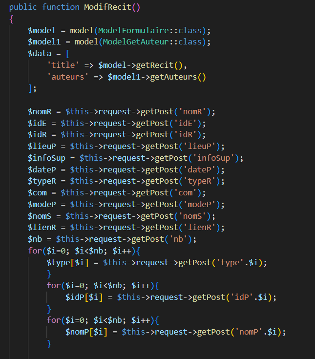
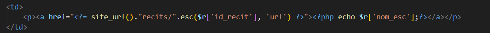
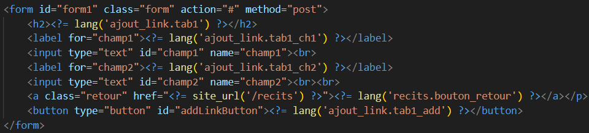
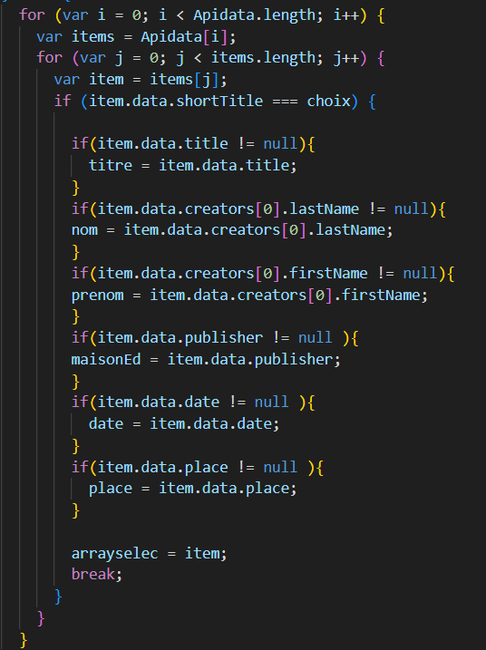
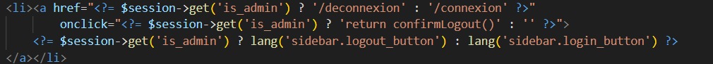
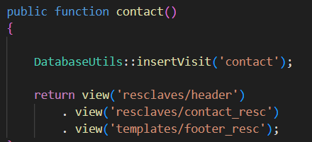

= Documation Technique
:toc: macro
:toc-title: Table des matières
:toclevels: 3

:hide-uri-scheme: 

== Introduction

Cette documentation a pour but de lister le fonctionnement du site web dans le cadre de futurs projets de développement. Vous retrouverez dans cette documentation les fonctionnalités listées et détaillées, ainsi que leur fonctionnement.

toc::[]

== Architecture Code Igniter 4

Code Igniter 4 utilise le modèle MVC (Modèle Vue Contrôleur).

image::images/Archi_racine.png[structure_racine]

Dans le projet, on retrouve 5 parties :

* La première est la configuration du projet Code Igniter avec le fichier .env à modifier pour le fonctionnement de votre site.

image::images/ArchiRacine1.png[structure_racine]

* La deuxième est les writables, ils stockent toutes les informations liées à des problèmes.

* Le troisième est le système. Tout le fonctionnement du site est contenu dedans.

image::images/Archi_racine_3.png[structure_racine]

* Le quatrième est le dossier public. Dans celui-ci, on peut retrouver les fichiers css, js ou tout autre langage utilisé.

image::images/Archi_racine_4.png[structure_racine]

* Le dernier est app, dans celui-ci on retrouve toute l'application, les vues, les contrôleurs et les modèles.

image::images/Archi_racine_5.png[structure_racine]

Rentrons dans app pour voir en détail l'application.

image::images/Archi_racine_5.png[structure_app]

Dans app, on retrouve plusieurs dossiers, mais nous allons nous focaliser sur certains dossiers en particulier.

* Le dossier config, où vous pourrez paramétrer l'application et définir les routes de votre projet. L'application utilise énormément les routes. Grâce à elles, on peut se déplacer dans l'application et réaliser des actions.

* Le dossier contrôleur, où on trouve les contrôleurs qui permettent la gestion des vues. Les contrôleurs importent les méthodes qui sont définies dans les modèles.

image::images/Archi_app_2.png[structure_app]

* Le dossier modèle, où il y a tous les modèles de méthodes. On y retrouve des méthodes de requête en base de données ou de récupération de données qui seront appliquées dans les contrôleurs.

image::images/Archi_app_3.png[structure_app]

* Le dossier langage, où on trouve la traduction de tous les champs affichés du site. Actuellement, il y a la version française et anglaise.

image::images/Archi_app_4.png[structure_app]

* Le dossier views qui stocke toutes les pages du site web, rangées dans des dossiers. Le dossier templates contient les pages pour le footer et la sidebar. Le dossier reclaves, quant à lui, contient toutes les autres pages du site web ainsi que le header.

image::images/Archi_app_5.png[structure_app]

== Base de données

Maintenant que vous avez vu la structure du projet, passons aux fonctionnalités.

== Accueil

=== Map
L'accueil est la page principale du projet, elle redirige vers la plupart des fonctionnalités du site web.

image::images/accueil.png[accueil]

`Accueil` correspond à la page `accueil.php`.

La carte correspond à :

image::images/accueil_map_code.png[accueil]

Voici le code JavaScript pour ajouter les cartes à la page. Ensuite, on retrouve l'ajout de boutons pour manipuler la map, la légende, et enfin l'ajout de cercles. L'image ne contient que la récupération des maps.

`Accueil.php` ne contient que la carte; la sidebar à droite vient de la page `sidebar.php`.

== Header

image::images/header.png[header]

Le fichier est `header_resc.php`.

image::images/header_code.png[header]

On y retrouve une barre de navigation (`navbar`) avec :

* `Accueil` qui renvoie vers la map en utilisant la route `map`
* La liste des récits avec la route `recit`
* Statistiques avec sa route.

De plus, on y retrouve le code pour définir la langue du site.

Le script JavaScript est utilisé lorsque le bouton est cliqué, et il va faire une recherche dans le dossier `language`, ici en anglais.

=== Accueil

Quand on clique sur `Accueil` dans le header, voici comment le code va exécuter cette action.

image::images/header_accueil_1.png[lien]

Quand `Accueil` est cliqué, il va chercher la route `map`.

image::images/header_accueil_2.png[route]

La route lui indique qu'il doit exécuter la méthode `index` de la classe `Map` (contrôleur Map).

image::images/header_accueil_3.png[traitement]

Il va importer les méthodes des modèles et les utiliser. Il teste si un des formulaires dans le sidebar est rempli, sinon il va faire l'affichage de base.

image::images/header_accueil_5.png[traitement de base]

Il va exécuter la méthode `getPoints` du modèle `Map`.

image::images/header_accueil_méthode.png[méthode getpoint]

Il va lier la table `tab_recit_v3` et `point` par leur `id_recit` et va retourner toutes les lignes dans `point` qui ont l'attribut `type` égal à `publication`. Les attributs des lignes récupérées par la requête seront égaux à la définition de `allowedFields` au-dessus de la méthode. Si un attribut n'est pas dans `allowedFields`, il ne sera pas récupéré.

Puis il va retourner les vues pour les afficher.

=== Liste Récit

Lorsque l'on clique sur `Liste des récits`, 

il va chercher la route `recit`.

image::images/header_recit_1.png[lien]

La route lui indique qu'il doit utiliser la méthode `index` du contrôleur `Recits`.

image::images/header_recit_2.png[route]

La méthode effectue tout d'abord des requêtes pour connaître l'ordre de tri des récits.

image::images/header_recit_3.png[méthode]

Ensuite, elle effectue des requêtes pour rechercher les récits dans `tab_recit_v3`.

image::images/header_recit_5.png[méthode]

image::images/header_recit_4.png[méthode]

Et enfin, elle retourne les vues pour les afficher (`recits.php`).

image::images/header_recit_6.png[liste recit]

Le tableau affiche les récits, avec pour chaque ligne, un lien vers le récit en détail, ainsi que des possibilités de modification et de suppression des récits depuis la liste.

==== Récit

==== Modification Récit

image::images/header_recit_modif_1.png[lien]

Chaque ligne `modifier` a pour lien `modif_recit` suivi des informations sur le récit sélectionné.

La route appelle la méthode `modif` du contrôleur `Modif`.

image::images/header_recit_modif_3.png[méthode]

La méthode récupère toutes les informations des récits, puis affiche la page de modification du récit avec un formulaire pour chaque champ.

image::images/header_recit_modif_4.png[affichage]

Elle va remplir les champs en parcourant les résultats de la méthode lorsque l'id du récit est égal à l'id du récit venant de l'URL.

Une fois cela fait, dès que l'on valide le formulaire, celui-ci utilise la route `Modif/ModifPoly_Recit`.

image::images/header_recit_modif_5.png[route]

La route renvoie vers la méthode `ModifPoly_Recit` du contrôleur `Modif`.

La méthode va récupérer tous les champs du formulaire.

Puis effectuer les traitements dans la base de données. Elle va modifier le récit avec les informations, supprimer les lignes dans `recit_poly` qui sont égales à l'id du récit, puis réinsérer dans la base de données les liaisons entre les polygones et les récits. Elle affichera ensuite la liste des récits.

==== Suppression Récit

Lors du clic sur le lien il va cherché la route "Suppr/SupprRecit" et demandé  avec une pop up une confirmation de la volonter de supprimer le récit.

la route va appeller la méthode SupprRecit du controlleur Suppr(Suppr.php)

image::images/header_recit_suppr_3.png[méthode]

La méthode va supprimer tout les points liées au récit ainsi que le récit et les liaisons être les récits et les polygones. Puis va afficher la liste des récits.

==== Récit en Détail

Lors que l'on clique sur un récit dans la liste, le formulaire appel la route recits/ + l'id du récit

La route appel la méthode view  du Controlleur Recits

La méthode récupère les infomations du récit sélectionnée dans les paramètre puis fait une recherche de toute les informations liée au récit en paramètre.Puis le champ "historiographie" est récupérer a pars pour être modifier.

Et enfin, on définis un pattern () et on recupère tout les occurences au lieu y a des paranthèses.

Pour chaque occurence des paranthèse on va diviser le texte avec comme séparateur la virgule. est l'affecté a $segments.

Si le segments a trois éléments, cela veux dire que dans la paranthèse on retrouve (Auteur,Titre raccourci, page). Puis on veut récupérer chaque élément et on vas générer un string qui appel la fonction javascript permétant de écupérer les infos de Zotero.

image::images/header_recit_recit_5.png[méthode5]

Si le nombre d'éléments est égale a 2, cela veux dire que il y a le (Titre,page).Mais le principe reste le même.

image::images/header_recit_recit_6.png[méthode6]

Si le nobre d'élement dans la paranthèse est égale a 1,cela ve dire que c'est un lien est donc on va récupérer les liens stocker dans la table Link. Si le lien existe il vas modifier les pour mettre le lien.Sinon il ne change rien.

image::images/header_recit_recit_7.png[méthode7]

Puis il affiche la page view avec les informations du récit.

=== Affichage d'un récit

Dans la page on retrouve toute les informations liée au récit sélectionnée.

==== Ajout d'un lien

Mais on trouve aussi la possibilité de modifier et supprimer le récit depusi cette page.Mais le principale est une possiblité d'ajouté des liens dans la bd.

Lors du clique sur le lien, la route appel "/ajout link"

La route appel la méthode ajout_link du controlleur Ajout.

La méthode s'occupe juste de d'afficher la page d'ajout.

Sur cette page on retrouve deux formualires.Le premier est juste un formulaire avec 2 champs, un pour le nom du lien et un autre pour le lien.

Quand on clique sur ajouter, le script java script s'occupe d'ajouté les information du 1er formulaire dans le tableau du deuxième.Cela permet d'ajouter plusieurs lie nen même temps.

image::images/header_recit_view_6.png[page]

LE 2ème formulaire sert a stocker et afficher les liens à ajouter.Quand on clique sur validé du formualaire, il appel la route "Ajout/InsertLink"

La route renvoie vers la méthode InsertLink du controlleur Ajout

image::images/header_recit_view_8.png[méthode]

La méthode vas inséret dans la table link les liens créé.

==== Api Zotero

L'api Zotero sera utilisé que dans la partie commentaire.

image::images/header_recit_api_2.png[js1]

Quand on clique sur un lien dasn cette partie il appel la méthode afficherPopup dans le but d'afficher des information détailler de la source.

Pour cela on trouve l'api avec la clé est l'userid mais aussi un notification en haut a droite de l'écrans pour informer l'utilisateur que la recherche est en cour.

image::images/header_recit_api_3.png[js2]

La fonction démare avec start et query a 0 et appel la méthode recursivesearch avec ces paramètres.

image::images/header_recit_api_4.png[js3]

la fonction quand a elle va appeller la fonction makesearchRequest aevc les paramètre quel a reçu. Puis a chaque résultat de cette fonction, elel va testé si la demande a était trouvé ou si il reste des éléments a recherché dasn l'api.Si il en reste, elle se rapelle avec les début de la recherche +25 éléments.Dans le cas ou il n'y a plus d'élément ou il a était trouvé elle appel la fonction checkdata.

image::images/header_recit_api_5.png[js4]

Cette fonction fait une requete de 25 éléments définis par la limit dans url de l'api et comment au x ème élments définis par le start reçu.Si il trouve l'élément il va modifier la variable found a true ce qui va stopper les requetes et faire l'affichage.

Quand checkData est appellé il remplis les champs par le résultat récupérer.

image::images/header_recit_api_7.png[js6]

Puis si le titre est définis il affiche un popup avec les informations de la sources et retire la notification de recherche.Mais si le titr en'ets pas définis il fait une popup avec information non trouvé.

=== Statistique

Quand on clique sur statistique, on utilise la route.

image::images/header_stat_1.png[lien]

Cette route nous renvoie sur la méthode statistiques du controlleur Admin.

image::images/header_stat_2.png[route]

Le controlleur va retourner les vues dans resclaves, statistique.php ainsi que le header.

image::images/header_stat_3.png[methode]

=== Language

en haut a droite du site web, il est possible de changé la langue du site.Quand on choisit un langue le code fait des requêtes pour remplacé tout les champ ou un retrouve "lang()".

image::images/header_lang_1.png[code_trad]

Pour cela il va cherché dans le fichier headergeo.php et il va chercher la ligne nav_bar.home ou nav_bar.list_narrative

image::images/header_lang_2.png[trad]

Il existe la meme chose pour le français.Cela permet d'avoir une traduction rapide et précise.

== sidebar

image::images/sidebar.png[sidebar]

Dans le sidebar on peut trouver plusieur fonctionnalités:

=== Sélectionner un type de lieu

le premier menu déroulant ou on peut rechercher par type de lieu permet d'afficher tout les points du type demandé.

image::images/sidebar_formpoint_1.png[form]

On peut voir le formulaire avec plein de if.Cela permet de definir le type de point recherché.Puis la route et définie dans le action du formulaire est non dans le bouton submit mais le principe reste le même.

image:images/sidebar_formpoint_2.png[route]

la route nous indique que l'on va utilisé la méthode index de la class Map comme quand si on voulais revenir a la carte.

image:images/sidebar_formpoint_3.png[méthode]

Sauf que cette fois ci on pas aps utilisé la dernière clause du if mais la clause ou select_place  est définis.notre formulaire va définir select_place avec un valeur ce qui voudras dire que on aa utilisé le formulaire.Suite a cela le code pas retourné les vues définis aevc comme information dans data. Les points qui sont du type choisie ainsi que les territoires a affiché sur la carte.

=== Sélectionner un récit

Le deuxième menu déroulant est un menu ou on peut choisir quel récit on veux afficher sur la carte.

image::images/sidebar_formrecit_1.png[form]

La route nous renvoie sur la méthode index du controlleur Map

image::images/sidebar_formrecit_2.png[route]

Et cette fois ci, on vas utiliser le premier if de la méthode car le formulaire a définis select_recit.

La méthode vas retourner les vues demandé avec toute les informations liée a un récit.

=== Menu de gestion

Dans le menu de gestion il y a deux groupe de lien :

Le premier groupe qui s'affiche que s'y l'utilisateur est connecté et une deuxième ou il affiche soit deconnection quand on est connecté ou connxion quand t'on ne les pas.

=== Déconnecté
Commençons par le début et donc quand on arrive sur le site web,l'utilisateur est déconnecté.

==== Connection

Pour se connecter, il faut cliquer sur le bouton suivant :

Comme l'utilisateur n'est pas connecté, il utilisera la route `/connexion` :

image::images/sidebar_gestionmenu_con_2.png[code]

Cette route renvoie vers la méthode `showconnexion` du contrôleur `Admin` :

La méthode renvoie la vue de connexion (`connexion.php`).

Sur la page de connexion, on peut remplir deux champs du formulaire (`username`, `password`) :

image::images/sidebar_gestionmenu_con_4.png[connexion]

Le formulaire enverra les données en utilisant sa route `/Admin/login` :

image::images/sidebar_gestionmenu_con_5.png[route]

Cette route mènera à la méthode `login` du contrôleur `Admin` :

image::images/sidebar_gestionmenu_con_6.png[connexion]

La méthode récupérera les champs du formulaire, hashera le mot de passe, et le comparera au mot de passe reçu dans la requête en utilisant

==== Ajout Point 

==== Ajout Récit

==== Ajout Polygone

==== Ajout Esclave/Auteur 

==== Modification d'un Esclave/auteur

==== Suppression d'un Esclave/auteur

== Footer

Dans le footer, on retrouve deux fonctionnalités : le contact avec la possibilité d'envoyer un mail à l'adresse mail du site et une page avec des informations et remerciements.

image::images/footer_code_1.png[code]

=== Contacts

Dans la route, on appelle la méthode `contact` du contrôleur `Map`.

image::images/footer_contact_2.png[route]

Cette méthode retourne la page `contact`.

Dans cette page, on retrouve un formulaire où l'on peut remplir les informations à transmettre dans le mail.

image::images/footer_contact_4.png[formulaire]

Mais on trouve aussi du JavaScript pour faire l'envoi du mail.

image::images/footer_contact_5.png[service_id]

Le premier bloc définit le service à utiliser par son identifiant.

Et le deuxième bloc contient l'envoi du mail avec le template à utiliser. Le template permet de pré-structurer le mail avec les informations fournies dans le mail.

image::images/footer_contact_7.png[template]

=== Information

Pour les informations du site web :

image::images/footer_about_2.png[route]

Le lien renvoie vers la méthode `about` du contrôleur `Map`.

image::images/footer_about_3.png[méthode]

La page contient juste des informations et des remerciements.
