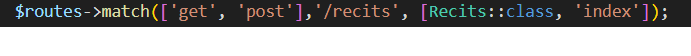

= Documation Technique :

:toc: macro
:toc-title: Table des matières

:hide-uri-scheme: 

== Introduction

Cette documentation a pour de lister le fonctionnement du site web dans le cadre de futur projet de développement sur celui-ci.Vous retrouverez dans la doc les fonctionnalitées listé et détaillé ainsi que leur fonctionnement.

toc::[]

== Architecture Code Igniter 4

Code Igniter 4 utilise le model MVC (Model Vue Controlleur).

image::images/Archi_racine[structure_racine]

Dans le projet on retrouve 5 parties :
----

* La première est la configuration du projet code igniter avec le fichier .env a modifier pour le fonctionnement de votre site.

image::images/Archi_racine_1[structure_racine]

* La deuxième est les writables, ils stocke tout les informations du a des problèmes.

image::images/Archi_racine_2[structure_racine]

* Le troixième est système. Tout le fonctionnement du site est dedans.

image::images/Archi_racine_3[structure_racine]

* le quatrième est public dasn celui ci on peut retrouvé les fichier css,js ou tout autre language utilisé.

image::images/Archi_racine_4[structure_racine]

* lle dernier est app, dans celui-ci on retrouve toute l'application, les vues ,les controlleur et les models.

image::images/Archi_racine_5[structure_racine]
----

Rentront dans app pour voir en detail l'application.

----

image::images/Archi_app[structure_app]

Dans app on retrouve plusieur dossier, mais on va ce focaliser sur quelque dossier.

* le dossier config ou vous pourrez paramètrer l'application et definir les routes de votre projet.L'application utilise énormément les routes. Grace a elle on peut ce déplacer dasn l'aplication et faire des actions.
* le dossier controlleur ou on trouve les controlleur permettent la gestion des vues, les controlleurs imports les méthodes qui sont définis dans les models.
* le dossier model ou il y a tout les models de méthodes.On y retrouve des méthodes de requète en base de données ou des récupèration de données qui seront appliqués dans les controlleurs.
* le dossier language ou on trouve la traduction de tout les champs affichers du site.Actuellement il y a la version française et anglaise.
* le dossier views qui stocke toute les pages du site web rangé des dans dossier. Templates contient les pages pour le footer et la sidebar. le dossier reclaves contient lui toute les autres pages du site web ainsi que le header.

----

Maintenant que vous avez vue la structure du projet passont a un detail par fonctionnalité.

== Accueil

=== map
Accueil est la page principale du projet, elle redirige vers la pluspard des fonctionnalitées du site web.

image::images/accueil.png[accueil]

Accueil correspond a la page accueil.php

la carte correspond a :

image::images/accueil_map_code.png[accueil]

Voici le code javascript pour ajouté les cartes a la page, puis on retrouve l'ajout de bouton pour manipulé la map ,la légende et enfin l'ajout de cercle.L'image ne contient que la récupération des map.

Accueil.php ne contient que la carte la sidebar a droite vien de la page sidebar.php

== Header

image::images/header.png[header]

Le fichier est header_resc.php

image::images/header_code.png[header]

On y retrouve une navbar avec accueil qui renvoie vers la map en utilisant la route map masi aussi la liste des récits avec la route recit et enfin statistique avec ca route.Mais on retrouve aussi le code pour definir la langue du site.

image::images/header_code_lang.png[header]

Le script js est utilisé quand le bouton est cliqué est il vas faire une recherche dans le dossier language , ici en anglais.

=== Accueil

Quand on clique sur accueil dans le header voici comme le code va exécuté cette action.

image::images/header_accueil_1.png[lien]

Quand accueil est cliqué il va cherché la route map.

image::images/header_accueil_2.png[route]

la route lui indique qu'il doit exécuté la méthode index de la class Map (controlleur Map).

image::images/header_accueil_3.png[traitement]

Il va import les méthodes des models et les utiliser. Il teste si un des formulaires dans le sidebar est remplie sinon il va faire l'affichage de base.

image::images/header_accueil_5.png[traitment de base]

il va éxécuté la méthode getPoints du modelMap.

image::images/header_accueil_méthode.png[methode getpoint]

Il va liée la table tab_recit_v3 et point par leur id_recit et vas retourné toute les lignes dans point qui on l'attribue type égale a publication.Les attribues des lignes récupérer par la requète seront égale a la définition de allowedFields au dessus de la méthode.SI un attribue n'est pas dans allowedFields il ne sera pas récupérer.

image::images/header_accueil_4.png[return]

puis il va retourné les vues pour les afficher.

=== Liste Recit

Quand on clique sur liste des récits

il va chercher la route "recit".

image::images/header_recit_1.png[lien]

la route lui indique qu'il doit utilisé la méthode index du controlleur Recits

La méthode fais tout d'abord des requete pour connaitre l'odre de tri des récits

image::images/header_recit_3.png[méthode]

puis va faire des requètes pour recherche les récits dans tab_recit_v3.

image::images/header_recit_5.png[méthode]

image::images/header_recit_4.png[méthode]

et enfin il va retourné les vues pour les afficher.

=== Statistique

=== Language

== sidebar

image::images/sidebar.png[sidebar]

Dans le sidebar on peut trouver plusieur fonctionnalités.
