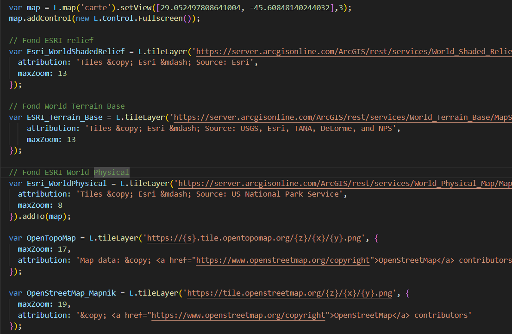
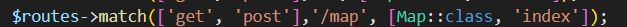
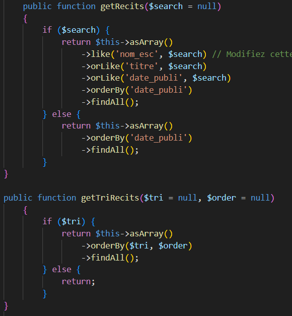
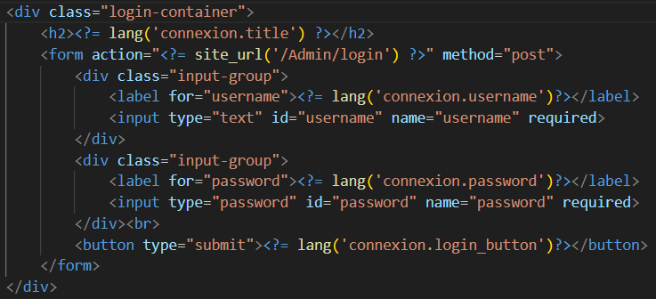
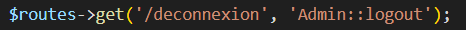
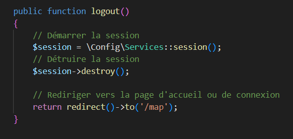

= Documation Technique :

:toc: macro
:toc-title: Table des matières

:hide-uri-scheme: 

== Introduction

Cette documentation a pour de lister le fonctionnement du site web dans le cadre de futur projet de développement sur celui-ci.Vous retrouverez dans la doc les fonctionnalitées listé et détaillé ainsi que leur fonctionnement.

toc::[]

== Architecture Code Igniter 4

Code Igniter 4 utilise le model MVC (Model Vue Controlleur).

image::images/Archi_racine.png[structure_racine]

Dans le projet on retrouve 5 parties :
----

* La première est la configuration du projet code igniter avec le fichier .env a modifier pour le fonctionnement de votre site.

image::images/Archi_racine_1[structure_racine]

* La deuxième est les writables, ils stocke tout les informations du a des problèmes.

image::images/Archi_racine_2[structure_racine]

* Le troixième est système. Tout le fonctionnement du site est dedans.

image::images/Archi_racine_3[structure_racine]

* le quatrième est public dasn celui ci on peut retrouvé les fichier css,js ou tout autre language utilisé.

image::images/Archi_racine_4[structure_racine]

* lle dernier est app, dans celui-ci on retrouve toute l'application, les vues ,les controlleur et les models.

image::images/Archi_racine_5[structure_racine]
----

Rentront dans app pour voir en detail l'application.

----

image::images/Archi_app[structure_app]

Dans app on retrouve plusieur dossier, mais on va ce focaliser sur quelque dossier.

* le dossier config ou vous pourrez paramètrer l'application et definir les routes de votre projet.L'application utilise énormément les routes. Grace a elle on peut ce déplacer dasn l'aplication et faire des actions.
* le dossier controlleur ou on trouve les controlleur permettent la gestion des vues, les controlleurs imports les méthodes qui sont définis dans les models.
* le dossier model ou il y a tout les models de méthodes.On y retrouve des méthodes de requète en base de données ou des récupèration de données qui seront appliqués dans les controlleurs.
* le dossier language ou on trouve la traduction de tout les champs affichers du site.Actuellement il y a la version française et anglaise.
* le dossier views qui stocke toute les pages du site web rangé des dans dossier. Templates contient les pages pour le footer et la sidebar. le dossier reclaves contient lui toute les autres pages du site web ainsi que le header.

----

Passont a la base de données liée au projet

== Base de données

----

----

Maintenant que vous avez vue la structure du projet et la base de données, passontaux fonctionnalitées.

== Accueil

=== map
Accueil est la page principale du projet, elle redirige vers la pluspard des fonctionnalitées du site web.

image::images/accueil.png[accueil]

Accueil correspond a la page accueil.php

la carte correspond a :

Voici le code javascript pour ajouté les cartes a la page, puis on retrouve l'ajout de bouton pour manipulé la map ,la légende et enfin l'ajout de cercle.L'image ne contient que la récupération des map.

Accueil.php ne contient que la carte la sidebar a droite vien de la page sidebar.php

== Header

image::images/header.png[header]

Le fichier est header_resc.php

image::images/header_code.png[header]

On y retrouve une navbar avec accueil qui renvoie vers la map en utilisant la route map masi aussi la liste des récits avec la route recit et enfin statistique avec ca route.Mais on retrouve aussi le code pour definir la langue du site.

image::images/header_code_lang.png[header]

Le script js est utilisé quand le bouton est cliqué est il vas faire une recherche dans le dossier language , ici en anglais.

=== Accueil

Quand on clique sur accueil dans le header voici comme le code va exécuté cette action.

image::images/header_accueil_1.png[lien]

Quand accueil est cliqué il va cherché la route map.

la route lui indique qu'il doit exécuté la méthode index de la class Map (controlleur Map).

image::images/header_accueil_3.png[traitement]

Il va import les méthodes des models et les utiliser. Il teste si un des formulaires dans le sidebar est remplie sinon il va faire l'affichage de base.

image::images/header_accueil_5.png[traitment de base]

il va éxécuté la méthode getPoints du modelMap.

image::images/header_accueil_méthode.png[methode getpoint]

Il va liée la table tab_recit_v3 et point par leur id_recit et vas retourné toute les lignes dans point qui on l'attribue type égale a publication.Les attribues des lignes récupérer par la requète seront égale a la définition de allowedFields au dessus de la méthode.SI un attribue n'est pas dans allowedFields il ne sera pas récupérer.

image::images/header_accueil_4.png[return]

puis il va retourné les vues pour les afficher.

=== Liste Recit

Quand on clique sur liste des récits

il va chercher la route "recit".

image::images/header_recit_1.png[lien]

la route lui indique qu'il doit utilisé la méthode index du controlleur Recits

image::images/header_recit_2.png[route]

La méthode fais tout d'abord des requete pour connaitre l'odre de tri des récits

image::images/header_recit_3.png[méthode]

puis va faire des requètes pour recherche les récits dans tab_recit_v3.

image::images/header_recit_5.png[méthode]

et enfin il va retourné les vues pour les afficher.

=== Statistique

Quand on clique sur statistique, on utilise la route.

image::images/header_stat_1.png[lien]

Cette route nous renvoie sur la méthode statistiques du controlleur Admin.

image::images/header_stat_2.png[route]

Le controlleur va retourner les vues dans resclaves, statistique.php ainsi que le header.

image::images/header_stat_3.png[methode]

=== Language

en haut a droite du site web, il est possible de changé la langue du site.Quand on choisit un langue le code fait des requêtes pour remplacé tout les champ ou un retrouve "lang()".

image::images/header_lang_1.png[code_trad]

Pour cela il va cherché dans le fichier headergeo.php et il va chercher la ligne nav_bar.home ou nav_bar.list_narrative

image::images/header_lang_2.png[trad]

Il existe la meme chose pour le français.Cela permet d'avoir une traduction rapide et précise.

== sidebar

image::images/sidebar.png[sidebar]

Dans le sidebar on peut trouver plusieur fonctionnalités:

=== Sélectionner un type de lieu

le premier menu déroulant ou on peut rechercher par type de lieu permet d'afficher tout les points du type demandé.

image::images/sidebar_formpoint_1.png[form]

On peut voir le formulaire avec plein de if.Cela permet de definir le type de point recherché.Puis la route et définie dans le action du formulaire est non dans le bouton submit mais le principe reste le même.

image:images/sidebar_formpoint_2.png[route]

la route nous indique que l'on va utilisé la méthode index de la class Map comme quand si on voulais revenir a la carte.

image:images/sidebar_formulaire_3.png[méthode]

Sauf que cette fois ci on pas aps utilisé la dernière clause du if mais la clause ou select_place  est définis.notre formulaire va définir select_place avec un valeur ce qui voudras dire que on aa utilisé le formulaire.Suite a cela le code pas retourné les vues définis aevc comme information dans data. Les points qui sont du type choisie ainsi que les territoires a affiché sur la carte.

=== Sélectionner un récit

Le deuxième menu déroulant est un menu ou on peut choisir quel récit on veux afficher sur la carte.

image::images/sidebar_formrecit_1.png[form]

La route nous renvoie sur la méthode index du controlleur Map

image::images/sidebar_formrecit_2.png[route]

Et cette fois ci, on vas utiliser le premier if de la méthode car le formulaire a définis select_recit.

image::images/sidebar_formrecit_3.png[méthode]

La méthode vas retourner les vues demandé avec toute les informations liée a un récit.

=== Menu de gestion

Dans le menu de gestion il y a deux groupe de lien :

image::images/sidebar_gestionmenu.png[code]

Le premier groupe qui s'affiche que s'y l'utilisateur est connecté et une deuxième ou il affiche soit deconnection quand on est connecté ou connxion quand t'on ne les pas.

=== Déconnecté
Commençons par le début et donc quand on arrive sur le site web,l'utilisateur est déconnecté.

==== Connection
Pour ce connecté il faut cliquer sur le bouton

image::images/sidebar_gestionmenu_con_1.png[code]

Vue que l'on n'est pas connecté il vas utilisé la route /connexion

image::images/sidebar_gestionmenu_con_2.png[code]

la route renvoie vers la méthode showconnexion du controlleur admin.

image::images/sidebar_gestionmenu_con_3.png[code]

la méthode renvoie la vue de connexion (connexion.php)

Sur la page de connexion on peut remplir deux champ du formulaire (username, password)

Le formulaire va renvoie en utilisant sa route "/Admin/login" 

image::images/sidebar_gestionmenu_con_5.png[route]

Celle ci qui renvoie vas la méthode login du controlleur admin

image::images/sidebar_gestionmenu_con_6.png[connexion]

la méthode vas récupérer les champ du formulaire hasher le password et comparer le password reçus par la requête avec comme paramètre le username avec les password donnée dans le formulaire.Si c'est correcte il créer un session "is_admin" qui permetta d'afficher des action limité au admin et redirige vers la map en utilisant la route /map ou si le password n'est pas bon il renvoie sur la page de connexion.

=== Connecté

==== Déconnection

Maintenant que l'on est connecter, le menu a changé de nouveau bouton sont apparue est parmis ceux ci déconnexion

image::images/sidebar_gestionmenu_con_1.png[code]

quand on clique sur le bouton déconnexion.

la route nous renvoie vers la méthode logout du controlleur admin.

La méthode quand à elle détruit la session "is_admin" est retourne la vers la route /map.