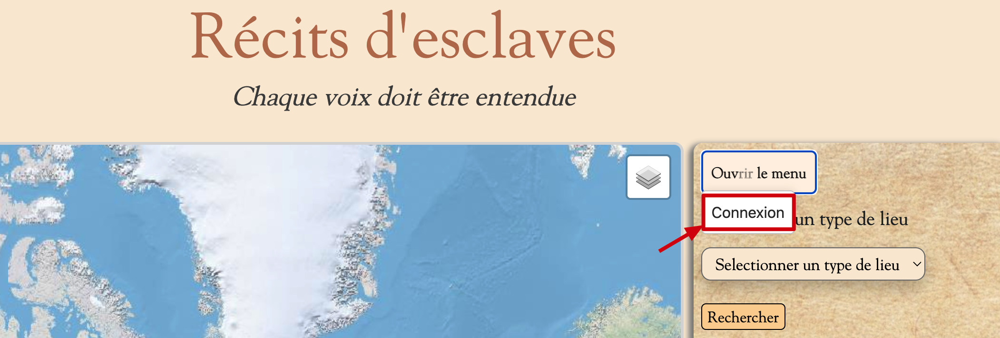
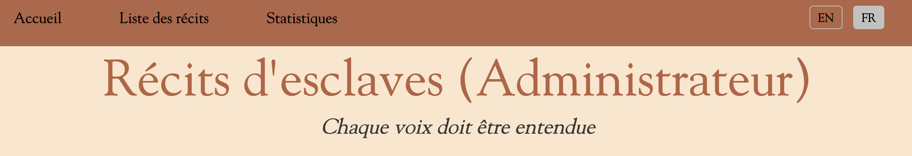
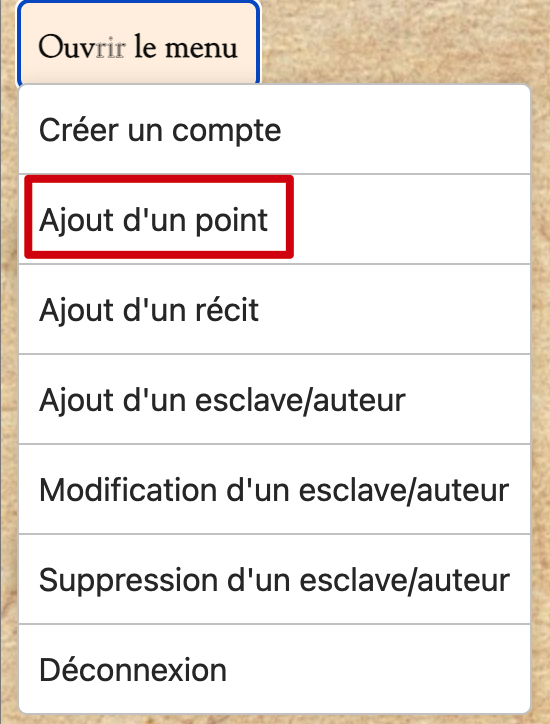
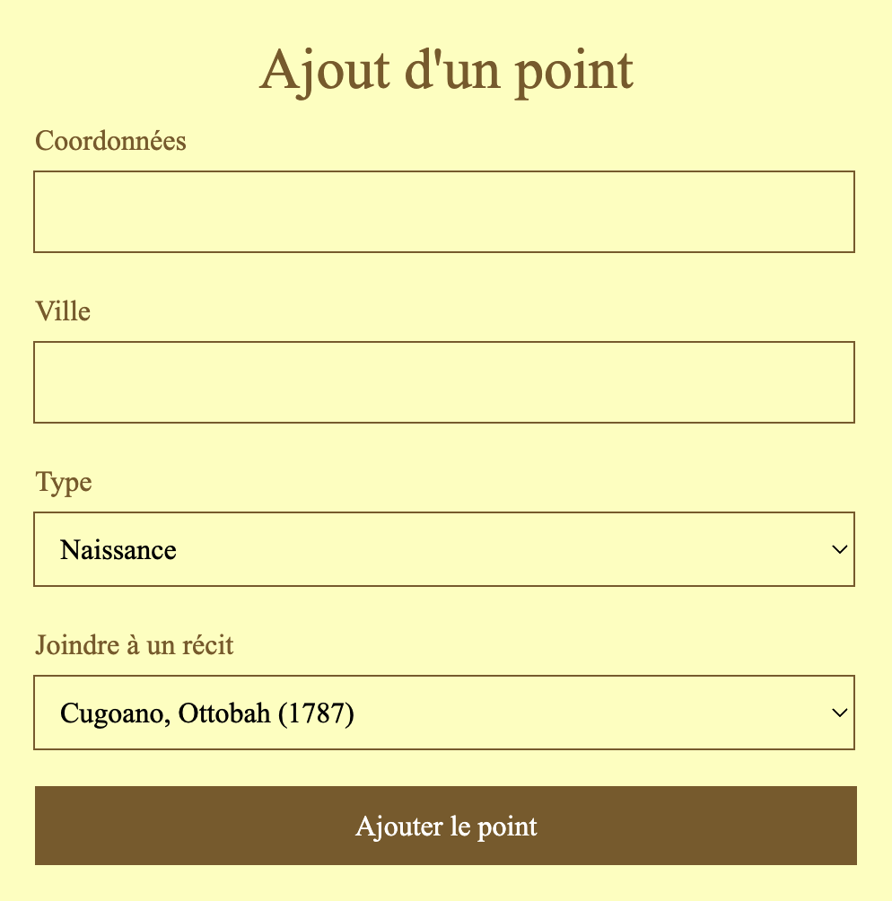
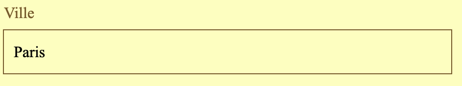
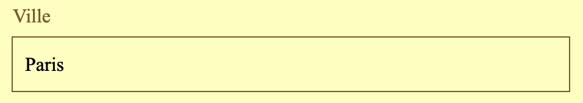

= Documentation Utilisateur site web G1A-1
:toc:
:toc-title: Table des matières
:sectnums:
:sectnumlevels: 4
:hide-uri-scheme:   

== Introduction
Bienvenue sur notre site web ! Ce guide d'utilisation a été conçu pour vous aider à naviguer sur notre site et à en tirer le meilleur parti. Il vous expliquera comment accéder aux différentes sections et fonctionnalités, ainsi que les étapes à suivre pour effectuer des tâches courantes, telles que la création d'un compte ou la consultation d'un produit. Si vous rencontrez des problèmes ou des questions, n'hésitez pas à consulter notre section d'aide ou à nous contacter directement. Merci d'utiliser notre site !

== Accéder au site web

Afin d'accéder à notre site ouvrez votre navigateur web et saisissez (ou cliquer simplement sur) l'adresse suivante : https://slave-narratives.univ-tlse2.fr/

== Accueil

Lorsque vous êtes redirigé vers notre site vous arrivez sur la page d'accueil. 

image::images/accueil.png[accueil]

=== En-tête du site 

Vous pouvez accéder à tout moment à la page d'accueil en cliquant sur le bouton `Accueil` de notre site en haut à gauche de la page.

image::images/boutonAccueil.png[accueil2]

Vous pouvez également accéder à la liste des récits en cliquant sur le bouton `Liste des récits` de notre site 

image::images/boutonListeRécit.png[accueil3]

=== Liste des récits

Une fois sur la page de la liste des récits vous pourrez découvrir la liste des récits disponibles sur notre site.

image::images/listeRécit.png[listeRécit]

Depuis cette page vous pouvez aussi accéder au détail du récit en cliquant sur le `nom de l'auteur` du récit. 

image::images/listeRécit2.png[listeRécit2]

=== Détail d'un récit

Une fois sur la page de détail d'un récit vous pourrez découvrir les informations relatives au récit sélectionné.

=== Recherche d'un type de lieu    

Vous pouvez rechercher un type de lieu en sélectionnant un type de lieu dans la liste déroulante `Rechercher un type de lieu` 

Puis en cliquant sur le bouton `Rechercher`.

image::images/rechercheLieu.png[rechercheTypeLieu2]

Cela aura pour effet de changer la couleur des points sur la carte. 

image::images/pointDiff.png[carte]

=== Recherche un récit

Vous pouvez rechercher un récit en sélectionnant un récit dans la liste déroulante `Rechercher un récit`

Puis en cliquant sur le bouton `Rechercher`.

image::images/rechercheRécit.png[rechercheRécit2]

Cela aura pour effet de mettre en valeur les différents lieux liée au récit sélectionné.

image::images/lieuRécit.png[lieuRécit]

=== Légende de la carte

Une légende est présente en bas à droite de la carte. Elle vous permet de savoir à quoi correspond les différents points et lieux sur la carte.

image::images/légende.png[légende]

== Partie Administrateur

=== Connexion

Pour accéder à la partie administrateur vous devez vous connecter en cliquant sur le bouton `Connexion` en bas à droite de la page en dessous de la légende.

Vous arrivez alors sur la page de connexion. Il vous suffit de saisir votre identifiant et votre     mot de passe puis de cliquer sur le bouton `Connexion`.

image::images/connexion2.png[connexion2]

Une fois la connexion effectuée vous serez redirigé vers la page d'accueil mais avec quelques ajouts. Un ajout sur le titre du site sera visible avec le mot `Connecté` afin de vous indiquer que vous êtes bien connecté.

Le menu du site a également changé, avec en plus un onglet "statistiques".
Update DocUtil.adoc

=== Déconnexion

Vous aurez également accès à un bouton `Déconnexion` en bas à droite de la page en dessous de la légende. Ce bouton vous permettra de vous déconnecter de la partie administrateur.

image::images/déconnexion.png[déconnexion]

====
*La déconnexion peut ne pas marcher si le navigateur que vous utilisez est Firefox.*
====

=== Liste des récits (Administrateur)

En tant qu'administrateur vous aurez accès à un bouton de modification et de suppression de récit sur la page de la liste des récits.

image::images/listeRécitAdmin.png[listeRécitAdmin]

=== Ajout d'un point

De plus, vous aurez accès à un bouton `Ajout d'un point` en bas à droite de la page en dessous du bouton de déconnexion. 

Vous serez alors redirigé vers la page d'ajout d'un point. Il vous faudra donc saisir les informations demandées afin d'ajouter un point sur la carte.

==== Ajout d'un point : Coordonnées

Tout d'abord il vous faudra saisir les coordonnées du point que vous souhaitez ajouter. Pour cela vous devrez cliquer sur le bouton `Agrandir le plan` afin de l'ouvrir. 

image::images/carteAjoutPoint.png[ajoutPoint3]

Vous pourrez effectuer un clique droit sur l'endroit de votre choix afin de récupérer les coordonnées géographiques.

Vous devrez ensuite saisir les coordonnées dans le champ `Coordonnées` de la page d'ajout d'un point.

==== Ajout d'un point : Ville 

Vous devrez ensuite saisir la ville dans le champ `Ville` de la page d'ajout d'un point.    

=== Ajout d'un point : Type de point

Vous devrez ensuite sélectionner le type de point que vous souhaitez ajouter dans la liste déroulante `Type de point` de la page d'ajout d'un point.

=== Ajout d'un point : Joindre à un récit

Vous pourrez ensuite sélectionner un récit dans la liste déroulante `Joindre à un récit` de la page d'ajout d'un point.

image::images/formAjoutPoint5.png[ajoutPoint8]

Il ne vous reste plus qu'à cliquer sur le bouton `Terminer` afin d'ajouter le point sur la carte. Le point sera alors visible sur la carte.

image::images/pointAjouté.png[ajoutPoint9]

=== Pied de page du site

Le pied de page contient des liens vers les pages tel que `A propos`, `Contact` (mettre lien vers explication page)

image::images/piedPage.png[pied de page]

==== À propos

Cette page permet d'avoir des informations sur le site et sur les personnes qui ont travaillé dessus.

image::images/àPropos.png[à propos]

==== Contact

Cette page permet de contacter Marie-Pierre BADUEL la cliente et gérante du site. 

====
*Non fonctionnel pour le moment*.
====

